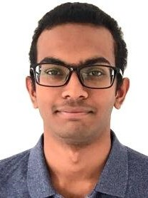
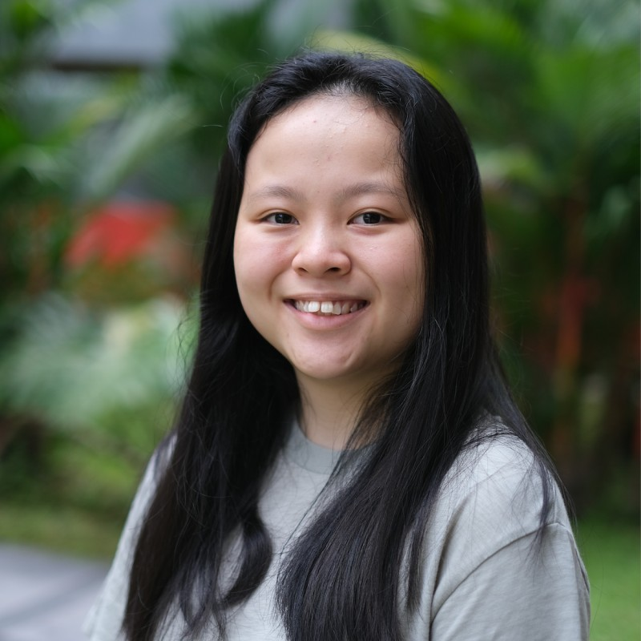
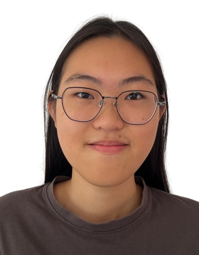
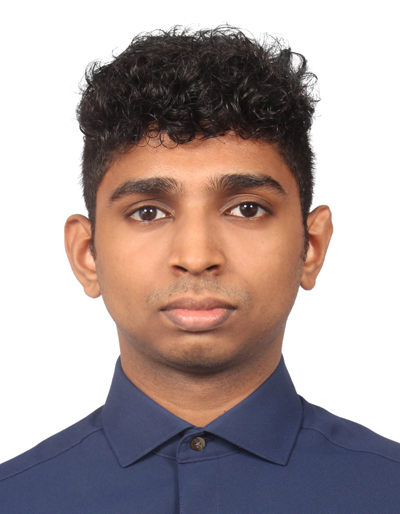

We are a team based in the [School of Computing, National University of Singapore](http://www.comp.nus.edu.sg).

You can reach us at the email `seer[at]comp.nus.edu.sg`

## Project Team

### Alagappan Ramanathan

[[Github](https://github.com/AlagappanRa)][[Portfolio](team/alagappanra.md)]

* Role: Developer
* Responsibilities: Testing

### Tay Ru Xin

[[Github](http://github.com/tayruxin)][[Portfolio](team/tayruxin.md)]

* Role: Developer
* Responsibilities: Deliverables and Deadlines

### Glenda Chong Rui Ting

[[Github](http://github.com/glendachong)][[LinkedIn](https://www.linkedin.com/in/glenda-chong-149367237)][[Portfolio](team/glendachong.md)]

* Role: Developer
* Responsibilities: Documentation

### Lim En Tian

[[Github](http://github.com/alientian)][[Portfolio](team/alientian.md)]

* Role: Developer
* Responsibilities: UI

### Ramu Rithik Vijay

[[Github](http://github.com/papataco14)][[LinkedIn](https://www.linkedin.com/in/rithikvijay/)][[Portfolio](team/papataco14.md)]

* Role: Developer
* Responsibilities: Deciphering requirements
