* Table of Contents
{:toc}

---
<div style="page-break-after: always;"></div>

## **Acknowledgements**

This project is based on the AddressBook-Level3 project created by the [SE-EDU initiative](https://se-education.org).

* Libraries used:
    * [JavaFX](https://openjfx.io/)
    * [Jackson](https://github.com/FasterXML/jackson)
    * [JUnit](https://junit.org/junit5/)

---

## **Setting Up, Getting Started**

Refer to the guide [_Setting up and getting started_](SettingUp.md).

---
<div style="page-break-after: always;"></div>

## **Design**

<div markdown="span" class="alert alert-primary">

:bulb: **Tip:** The `.puml` files used to create diagrams in this document `docs/diagrams` folder. Refer to the [_PlantUML Tutorial_ at se-edu/guides](https://se-education.org/guides/tutorials/plantUml.html) to learn how to create and edit diagrams.

</div>

### Architecture


The **_Architecture Diagram_** given above explains the high-level design of the App.

Given below is a quick overview of main components and how they interact with each other.

**Main components of the architecture**

**`Main`** (consisting of classes [`Main`](https://github.com/se-edu/addressbook-level3/tree/master/src/main/java/seedu/address/Main.java) and [`MainApp`](https://github.com/se-edu/addressbook-level3/tree/master/src/main/java/seedu/address/MainApp.java)) is in charge of the app launch and shut down.

-   At app launch, it initializes the other components in the correct sequence, and connects them up with each other.
-   At shut down, it shuts down the other components and invokes cleanup methods where necessary.

The bulk of the app's work is done by the following four components:

-   [**`UI`**](#ui-component): The UI of the App.
-   [**`Logic`**](#logic-component): The command executor.
-   [**`Model`**](#model-component): Holds the data of the App in memory.
-   [**`Storage`**](#storage-component): Reads data from, and writes data to, the hard disk.

[**`Commons`**](#common-classes) represents a collection of classes used by multiple other components.

**How the architecture components interact with each other**

The _Sequence Diagram_ below shows how the components interact with each other for the scenario where the user issues the command `delete 1`.

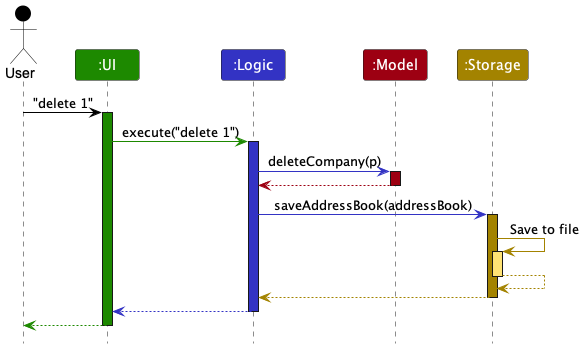

Each of the four main components (also shown in the diagram above),
-   defines its _API_ in an `interface` with the same name as the Component.
-   implements its functionality using a concrete `{Component Name}Manager` class (which follows the corresponding API `interface` mentioned in the previous point.

For example, the `Logic` component defines its API in the `Logic.java` interface and implements its functionality using the `LogicManager.java` class which follows the `Logic` interface. Other components interact with a given component through its interface rather than the concrete class (reason: to prevent outside component's being coupled to the implementation of a component), as illustrated in the (partial) class diagram below.


The sections below give more details of each component.

### UI Component

The **API** of this component is specified in [`Ui.java`](https://github.com/se-edu/addressbook-level3/tree/master/src/main/java/seedu/address/ui/Ui.java)

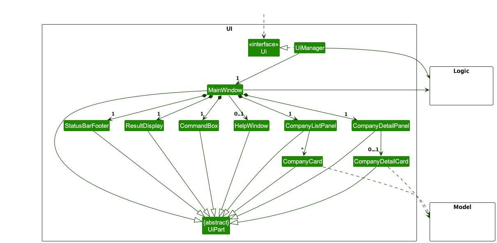

The UI consists of a `MainWindow` that is made up of parts e.g.`CommandBox`, `ResultDisplay`, `CompanyListPanel`, `CompanyDetailPanel`, `StatusBarFooter` etc. All these, including the `MainWindow`, inherit from the abstract `UiPart` class which captures the commonalities between classes that represent parts of the visible GUI.

The `UI` component uses the JavaFx UI framework. The layout of these UI parts are defined in matching `.fxml` files that are in the `src/main/resources/view` folder. For example, the layout of the [`MainWindow`](https://github.com/se-edu/addressbook-level3/tree/master/src/main/java/seedu/address/ui/MainWindow.java) is specified in [`MainWindow.fxml`](https://github.com/se-edu/addressbook-level3/tree/master/src/main/resources/view/MainWindow.fxml)

The `UI` component,

-   executes user commands using the `Logic` component.
-   listens for changes to `Model` data so that the UI can be updated with the modified data.
-   keeps a reference to the `Logic` component, because the `UI` relies on the `Logic` to execute commands.
-   depends on some classes in the `Model` component, as it displays `Company` object residing in the `Model`.

### Logic Component

**API** : [`Logic.java`](https://github.com/se-edu/addressbook-level3/tree/master/src/main/java/seedu/address/logic/Logic.java)

Here's a (partial) class diagram of the `Logic` component:


The sequence diagram below illustrates the interactions within the `Logic` component, taking `execute("delete 1")` API call as an example.


<div markdown="span" class="alert alert-info">:information_source: **Note:** The lifeline for `DeleteCommandParser` should end at the destroy marker (X) but due to a limitation of PlantUML, the lifeline reaches the end of diagram.
</div>

How the `Logic` component works:

1. When `Logic` is called upon to execute a command, it is passed to an `AddressBookParser` object which in turn creates a parser that matches the command (e.g., `DeleteCommandParser`) and uses it to parse the command.
2. This results in a `Command` object (more precisely, an object of one of its subclasses e.g., `DeleteCommand`) which is executed by the `LogicManager`.
3. The command can communicate with the `Model` when it is executed (e.g. to delete a company).
4. The result of the command execution is encapsulated as a `CommandResult` object which is returned back from `Logic`.

Here are the other classes in `Logic` (omitted from the class diagram above) that are used for parsing a user command:


How the parsing works:

-   When called upon to parse a user command, the `AddressBookParser` class creates an `XYZCommandParser` (`XYZ` is a placeholder for the specific command name e.g., `AddCommandParser`) which uses the other classes shown above to parse the user command and create a `XYZCommand` object (e.g., `AddCommand`) which the `AddressBookParser` returns back as a `Command` object.
-   All `XYZCommandParser` classes (e.g., `AddCommandParser`, `DeleteCommandParser`, ...) inherit from the `Parser` interface so that they can be treated similarly where possible e.g, during testing.

### Model Component

**API** : [`Model.java`](https://github.com/se-edu/addressbook-level3/tree/master/src/main/java/seedu/address/model/Model.java)

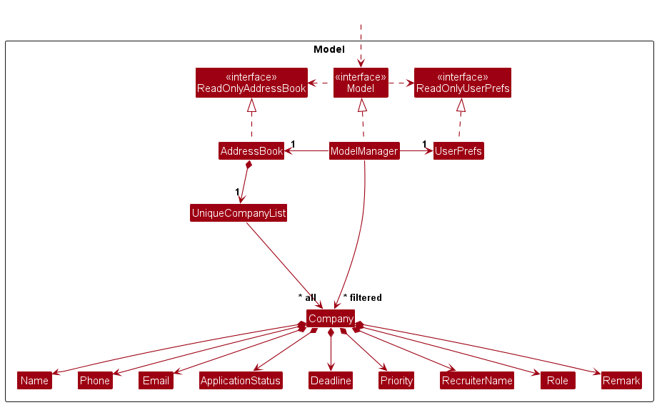

The `Model` component,

-   stores the address book data i.e., all `Company` objects (which are contained in a `UniqueCompanyList` object).
-   stores the currently 'selected' `Company` objects (e.g., results of a search query) as a separate _filtered_ list
    which is exposed to outsiders as an unmodifiable `ObservableList<Company>` that can be 'observed' e.g. the UI can be
    bound to this list so that the UI automatically updates when the data in the list change.
-   stores a `UserPref` object that represents the user’s preferences. This is exposed to the outside as a `ReadOnlyUserPref` objects.
-   does not depend on any of the other three components (as the `Model` represents data entities of the domain, they should make sense on their own without depending on other components)

### Storage Component

**API** : [`Storage.java`](https://github.com/se-edu/addressbook-level3/tree/master/src/main/java/seedu/address/storage/Storage.java)

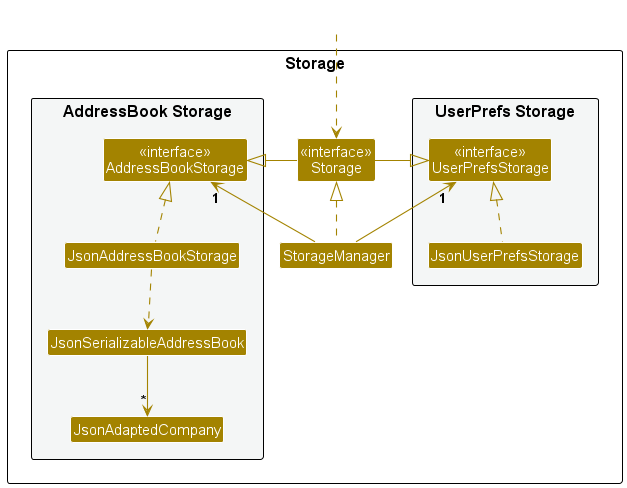

The `Storage` component,

-   can save both address book data and user preference data in JSON format, and read them back into corresponding objects.
-   inherits from both `AddressBookStorage` and `UserPrefStorage`, which means it can be treated as either one (if only the functionality of only one is needed).
-   depends on some classes in the `Model` component (because the `Storage` component's job is to save/retrieve objects that belong to the `Model`)

### Common Classes

Classes used by multiple components are in the `seedu.addressbook.commons` package.

---
<div style="page-break-after: always;"></div>

## **Implementation**

This section describes some noteworthy details on how certain features are implemented.

### Company Detail Panel (UI component)
The `CompanyDetailPanel` allows the user to view the company details of the selected company in the company list.
Recruiter's information, company's information and remarks will be shown in the `CompanyDetailPanel`.

#### Implementation

`CompanyDetailCard` and `CompanyDetailPanel`, both inheriting `UiPart`, are used to display the company details. More details of the class implementation can be seen in the class diagram below.

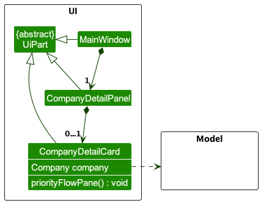

`CompanyDetailCard` calls the static method `createPriorityFlowPane` from `CompanyCardUtils`, which creates a `FlowPane` to display the priority of the company.
The color of the `FlowPane` is determined by the priority of the company. Red is used to indicate high priority,
orange is used to indicate medium priority and green is used to indicate low priority.

As for the other information, FXML labels are used to display the information. Within the constructor of `CompanyDetailCard`,
the respective FXML labels are set with the information of the company.

To display the details in 3 different boxes, `CompanyDetailCard.fxml` is divided into 3 sections with each section
being a `VBox`. The 3 `VBox` are then added into a `HBox` to display the details in 3 different boxes.

As for `CompanyDetailPanel`, there is an inner class `CompanyDetailViewCell` which extends `ListCell<Company>`. This class
sets the graphics to the `CompanyDetailCard` by constructing a new `CompanyDetailCard` with the company details of the company.

#### Design Considerations

**Aspect: How details of the company are displayed**

-   **Alternative 1 (Current Choice):** Display the details of the company in a separate panel.

    -   Pros: The information is well compartmentalized. This improves the user viewing experience.
    -   Cons: One additional command is needed to view the details of the company.

-   **Alternative 2:** Display all the details of the company in the same panel as the company list.
    -   Pros: The user does not need to key in additional commands to view the details of the company.
    -   Cons: The `CompanyListPanel` will be too cluttered with too much information displayed in a company card.

### View Feature
The `CompanyDetailPanel` allows the user to view the company details of the selected company in the company list.
The user can use the `view` command to select the company to view.

#### Implementation
A new `UniqueCompanyList` is created in `AddressBook` to store the selected company which the user wishes to view.
Additionally, the following operations are implemented in `AddressBook` to support the `view` and other commands:

-   `setCurrentViewedCompany(Company company)` - Sets the selected company to be viewed.
-   `clearDetailPanel()` - Clears the `UniqueCompanyList` to remove the selected company from the company detail panel.

These operations are exposed in the `Model` interface as `Model#setCurrentViewedCompany(Company company)` and
`Model#checkDelete()` respectively.

The `view` function is implemented in the `ViewCommand` class which calls `Model#setCurrentViewedCopany(Company company)`
to insert the selected company into the `UniqueCompanyList`.
The follow sequence diagram depicts how the `view` command is executed.

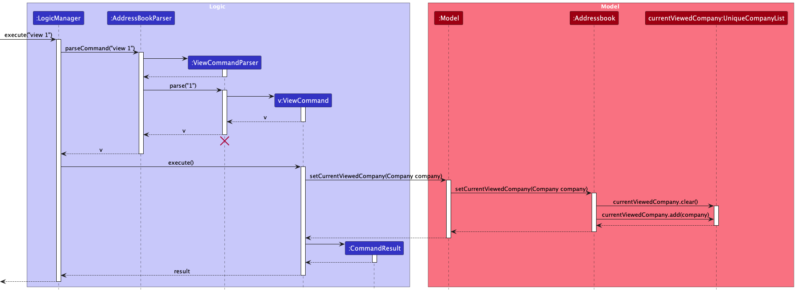

<div markdown="block" class="alert alert-info">
 **:information_source: Note:**
 The lifeline for `ViewCommandParser` should end at the destroy marker (X) but due to a limitation of PlantUML, the lifeline reaches the end of diagram.
 </div>

Since only the detail of one company will be displayed anytime, `Model#setCurrentViewedCopany(Company company)` will
clear the `UniqueCompanyList` before inserting the selected company.
Since `UniqueCompanyList` is an observable list, the `CompanyDetailPanel` will be updated automatically
when there is any changes made to the `UniqueCompanyList`.

When the `edit`, `add`, `view` or `delete` command is executed, the `CompanyDetailPanel` will be updated respectively as
shown in the activity diagram below.

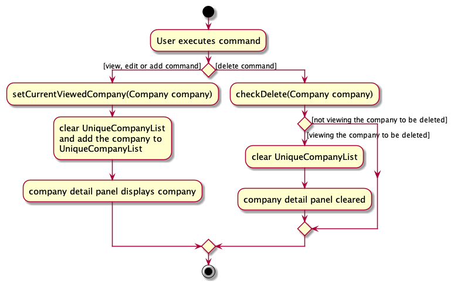

#### Design Considerations

**Aspect: How the company to be viewed is stored in the `AddressBook`**

-   **Alternative 1 (Current Choice):** Create a new `UniqueCompanyList` in `AddressBook` to store the selected company which the user wishes to view.

    -   Pros: Since the `UniqueCompanyList` is an observable list, the `CompanyDetailPanel` will be updated automatically when there is any changes made to the `UniqueCompanyList`.
    -   Cons: There is a need to clear the list before adding the selected company to the `UniqueCompanyList` to ensure that only one company is displayed in the `CompanyDetailPanel` at any time.

-   **Alternative 2:** Create a new `Company` object in `AddressBook` to store the selected company which the user wishes to view.
    -   Pros: Since there are no lists involved, there is no need to clear the list.
    -   Cons: The `CompanyDetailPanel` will not be updated automatically when there are any changes made to the `Company` object. There is a need to create additional methods to update the `CompanyDetailPanel` when changes are made to the `Company` object.

### Find Feature

#### Implementation

The `find` command allows users to search for companies using one or more keywords. Companies matching any of the keywords in their names will be returned. This search is case-insensitive, and partial matches are valid. The critical change in the implementation centers around the modification of the `NameContainsKeywordsPredicate` class.

**How `NameContainsKeywordsPredicate` Works**

Previously, `NameContainsKeywordsPredicate` was designed to match a company name against a whole keyword. However, the modified implementation allows it to test a company's name against substrings and return true if the company's name contains the substring.

When `find` is executed, it uses the `Model` interface's `updateFilteredCompanyList(Predicate<Company> predicate)` method, passing in the modified `NameContainsKeywordsPredicate` to filter the list of companies.

The sequence diagram below illustrates the processing of a `find` command, such as `find Micr`:

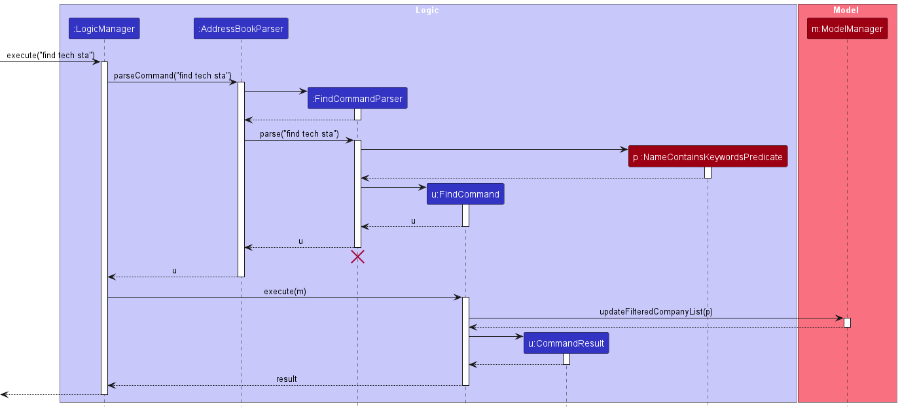

<div markdown="block" class="alert alert-info">
**:information_source: Note:** 
The above sequence diagram simplifies the interaction by focusing on the primary components involved in processing the `find` command.
</div>

#### Design Considerations

**Aspect: Approach to matching keywords**

-   **Alternative 1 (Current Choice):** Match company names that contain the keyword **anywhere** within them.

    -   Pros: Flexible search, allows partial keyword matching.
    -   Cons: Might produce more results than expected.

-   **Alternative 2:** Match company names that **start** with the given keyword.

    -   Pros: Precise results.
    -   Cons: Might omit some relevant results if user does not remember the exact start of the company's name.

**Aspect: Case-sensitivity**

-   **Alternative 1 (Current Choice):** Case-insensitive matching.

    -   Pros: User-friendly; users don’t need to remember exact case.
    -   Cons: Might produce a broader range of results.

-   **Alternative 2:** Case-sensitive matching.

    -   Pros: More exact matches.
    -   Cons: Less user-friendly, especially if users do not recall the exact case of company names.

With the design considerations, we've chosen the alternatives that provide a balance between user-friendliness and precision.

### Filter Feature

The `filter` command allows users to filter the list of companies based on the valid application status. 

#### Implementation

The `filter` command uses a new predicate, `ApplicationStatusPredicate`, which tests and returns true if a company's application status matches the application status input specified by the user. The `ApplicationStatusPredicate` class implements the `Predicate` interface, which allows it to be used in the `Model#updateFilteredCompanyList(Predicate<Company> predicate)` method to filter the list of companies. All companies that match the application status input will be displayed in the updated `CompanyListPanel`.

The following sequence diagram will illustrate the process of performing the `filter` command, taking `filter s/pa` as an example.

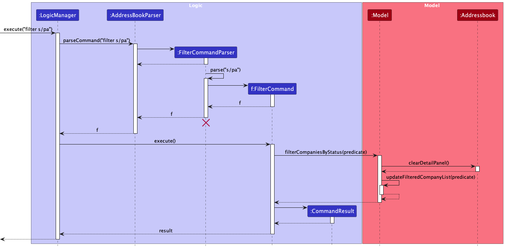

<div markdown="block" class="alert alert-info">
**:information_source: Note:**
The lifeline for `FilterCommandParser` should end at the destroy marker (X) but due to a limitation of PlantUML, the lifeline reaches the end of diagram.
</div>

#### Design Considerations

**Aspect: UI of the Filter Command**

* **Alternative 1:** The `CompanyDetailPanel` will still display the details of the company that was last viewed before the `filter` command is executed.
  * Pros: Users can still view the details of the last viewed company in the `CompanyDetailPanel` alongside the filtered list of companies.
  * Cons: Users may be confused as the last viewed company in the `CompanyDetailPanel` may not be in the filtered list of companies after filtering.

* **Alternative 2 (Current Choice):** The `CompanyDetailPanel` will be cleared whenever the `filter` command is executed.
    * Pros: Users can focus on viewing details of company(s) belonging to the filtered list only, reducing distractions and confusions.
    * Cons: Users might have to execute the `view` command again to access details of the last viewed company before filtering even if that company is still in the filtered list, potentially leading to additional steps taken.

### Edit Feature

#### Implementation
The edit mechanism is facilitated by `EditCompanyDescriptor`, which is a nested class of `EditCommand` that is similar to the `Company` model, except that the value of fields can be null.
The `EditCommandParser` parses the user input and stores the values of the fields to be edited in an `EditCompanyDescriptor` object while unedited fields are `null`.
Additionally, `EditCommand` implements the `EditCommand#execute(Model model)`operation which edits all the fields indicated by the user input.
This operation is exposed in the `Model` interface as:

* `Model#setCompany(Company target, Company editedCompany)` - Updates a company in the list to a new company with edited fields.
* `Model#setCurrentViewedCompany(Company company)` - Sets the selected company to be viewed in the `CompanyDetailPanel`.

The following sequence diagram will illustrate the process of performing the `edit` command.

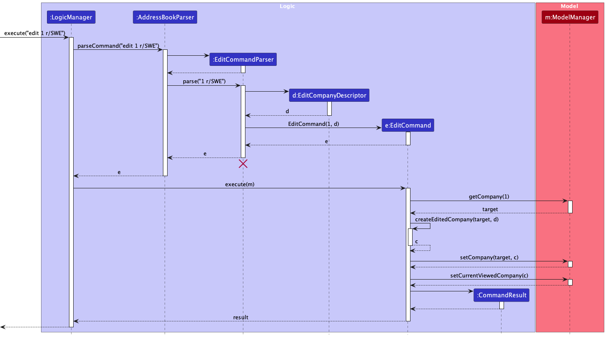

<div markdown="block" class="alert alert-info">
**:information_source: Note:**
The lifeline for `EditCommandParser` should end at the destroy marker (X) but due to a limitation of PlantUML, the lifeline reaches the end of diagram.
</div>

When `EditCommand#execute()` is called, an edited `Company` object is created in `EditCommand#createEditedCompany(Company companyToEdit, EditCompanyDescriptor editCompanyDescriptor)` since `Company` is immutable.
When `Model#setCompany(Company company)` is called, the original `Company` object in the `AddressBook` is replaced with the edited `Company` object.

#### Design Considerations

**Aspect: How to edit different attributes of a company**

* **Alternative 1 (Current Choice):** Edits all attributes using one command.
    * Pros: Easy to implement.
    * Cons: More prone to errors and bugs/ require more test cases for code coverage.

* **Alternative 2:** Have a command to edit each attribute.
    * Pros: Command line is shorter which reduces users' error such as duplicates or invalid command. This improves user experience.
    * Cons: We must ensure that the implementation of each individual command are correct. This may also require more memory usage, a Company object is initialized for every modified attribute.

### Duplicate detection

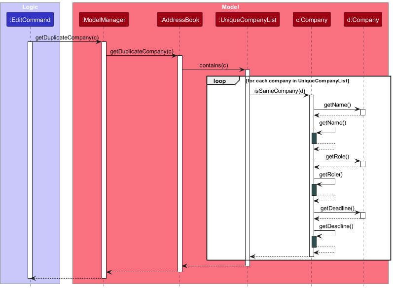

#### Implementation
The term _duplicate_ hereafter refers to companies with the same company name, role and deadline

The _duplicate_ detection mechanism is facilitated by `Company#isSameCompany(Company otherCompany)`.
This method checks if two `Company` entities are the same by checking if their `Name`, `Role` and
`Deadline` fields are equal. This method is used by `AddCommand` and `EditCommand` to check if
the company to be added or edited already exists in the company list.

The above sequence diagram shows the events when a user attempts to **edit** the details of an existing company,
namely the company name, role and deadline fields to match that of another company in the company list.
The purpose of the diagram is a **simplified** view of the message passing when a _duplicate_ company is detected.

Therefore, the diagram omits the following
1. The `if` statement in the `EditCommand` class that checks if the edited company is the same as the company to be
   edited before the call to `getDuplicateCompany(c)`. This is removed as the purpose of the diagram is to show the message
   passing **after** a duplicate company is detected.
1. The `if` statements in the `isSameCompany` method checking for strict equality with `this` and company d with`null`.
   This is removed to simplify the diagram and not show the inner-workings of the method in detail.
1. The `equals` method propagated after the `getName()`, `getRole()` and `getDeadline()` methods. Again, this would
   involve the details of the equality checks of the `Name`, `Role` and `Deadline` classes which is not the focus of the
   diagram.
1. The instantiation of the `CommandException` class through the `super` call from `DuplicateException` class.
   This is removed to simplify the diagram.

**Description of the diagram**

Upon ascertaining that the edited company is a duplicate,
1. The `EditCommand` class calls the `getDuplicateCompany(c)` method in the `ModelManager` class.
1. `ModelManager` forwards the call to the `AddressBook` class.
1. The `AddressBook` class calls the `contains(c)` method in the `UniqueCompanyList` class.
1. The `UniqueCompanyList` class calls the `Company::isSameCompany` method for each company in the list
   to check if the edited company is a duplicate.
1. `Company::isSameCompany` self-invokes the `getName()`, `getRole()` and `getDeadline()` methods and also
   invokes the `getName()`, `getRole()` and `getDeadline()` on the company d to check for equality.
1. The duplicated company is returned to the `EditCommand` class.
1. From there, the message is formatted by the `Messages` class using the `getDupErrMsgEdit()` method.
1. The `EditCommand` class then instantiates a `DuplicateException` instance with the formatted message.
1. Error is thrown back to the caller of the `EditCommand` class.

Below is an activity diagram showing the events when a user attempts to **add** a duplicate company to the company list.

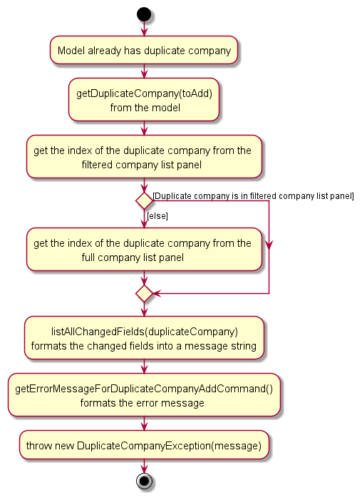

The purpose of the diagram is to show the difference in the message passing when a duplicate company is detected
between the `AddCommand` and `EditCommand` classes. Therefore, the diagram omits the propagation of the
getDuplicateCompany(toAdd) method, which has already been shown in the sequence diagram prior.

#### Design Considerations
**Aspect: Change the location of the duplicate detection**
- **Alternative:** Implement the duplicate detection logic within the `AddCommandParser` or `EditCommandParser` classes.
    - Pros: The `execute` method's sole responsibility will be to execute the add or edit command without
      needing to handle duplicate detection logic, adhering to the Single Responsibility Principle.
    - Cons: The current architecture design dictates that `Model` be separate from `Logic`. The interaction
      between `Model` and `Logic` is through the `execute` method. Implementing the duplicate detection in the
      `Parser` classes will require the `Parser` classes to have access to the `Model` class, which violates the
      current architecture design.

**Aspect: Change the definition of a _duplicate_**
- **Alternative:** Define _duplicates_ as equivalence of all fields other than just `Name`, `Role` and `Deadline`.
    - Pros: Allows users to add companies with the same name, role and deadline but different contact details.
    - Cons: This approach does not align with real-world scenarios where if the Name, Role, and Deadline fields
      are identical, it likely indicates the same job application. The purpose of the duplicate detection is to prevent
      interns from inadvertently applying multiple times to the same position at a company with the same role and
      application deadline.


### Remark Feature

The `remark` feature allows user to add and delete remarks from a company.

#### Implementation

Unlike other `Command` class, the `RemarkCommand` class has two `COMMAND_WORD` - remark and unremark.
Hence, it is a dependency for two `Parser` - `RemarkCommandParser` and `UnremarkCommandParser`.
The two command words require two different parsers as they have different command format.
Meanwhile, both can create the same type of Command object, `RemarkCommand`, because both command words results in a change in remarks of a company.
The following activity diagram will show how `RemarkCommand` can achieve the functionality of both `COMMAND_WORD`.

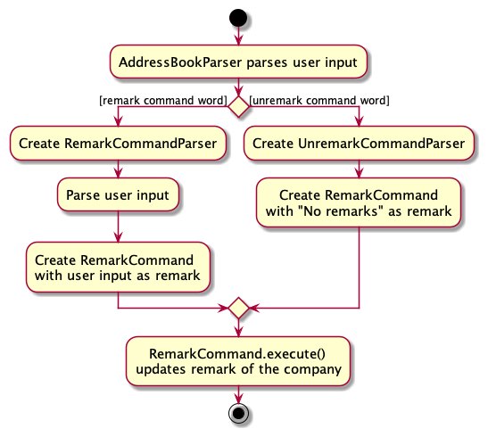

The remark feature has a similar implementation as the [edit feature](#edit-feature), except that a `Remark` object is initialized instead of `EditCompanyDescriptor`.

#### Design Considerations

**Aspect: Implementation of `COMMAND_WORD` for Remark**
- **Alternative 1 (current choice):** Use two `COMMAND_WORD`
    - Pros: More specific commands allow for better error handling i.e empty remark can be considered invalid input, thus more defensive programming
    - Cons: More test cases needed to find bugs/More prone to bugs if error handling not implemented correctly.
- **Alternative 2:** Use only one `COMMAND_WORD` - remark
    - Pros: Easier to implement.
    - Cons: Remarks may be accidentally deleted by an empty input for the parameter. This can affect user experience negatively.

### Add Feature
The `add` command allows users to add companies into LinkMeIn. 

#### Implementation
The `add` feature is implemented using the `AddCommand` class. The `AddCommand` object takes in a `Company` object. Only if all the inputs for the parameters are valid and all compulsory parameters are present, then the `Company` object is created.

The `add` feature includes the following operations in `ModelManager`, which implements the `Model` interface:
* `Model#hasCompany(Company company)` — Checks if the company already exists in LinkMeIn. Duplicate companies are those with the same company name, application role and application deadline.
* `Model#addCompany(Company company)` — Adds a company into LinkMeIn.
* `Model#setCurrentViewedCompany(Company company)` - Sets the selected company to be viewed in the `CompanyDetailPanel`.

The following sequence diagram illustrates how the `add` command works and interacts between the `Logic` and `Model` components, taking the input `add c/Google r/Software Engineer s/PA d/10-10-2023 n/Francis Tan p/98765432 e/francist@gmail.com` as an example.

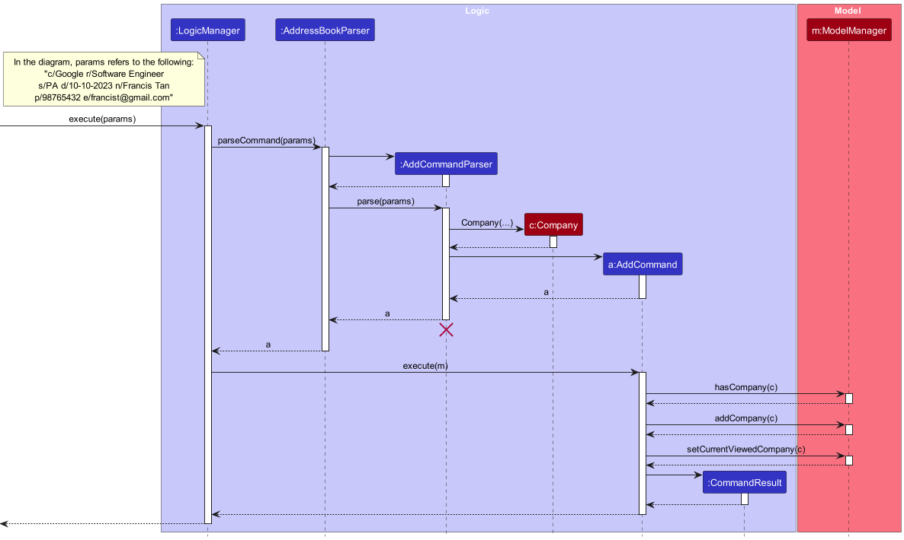

<div markdown="block" class="alert alert-info">
**:information_source: Note:**
The lifeline for `AddCommandParser` should end at the destroy marker (X) but due to a limitation of PlantUML, the lifeline reaches the end of diagram.
</div>

The following activity diagram shows what happens when the user executes the `add` command.

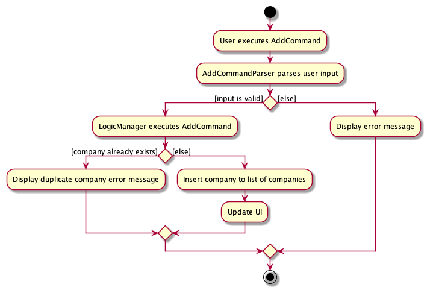

#### Design Considerations
**Aspect: Parameters to be Added into Company**

* **Alternative 1:** A `Company` object only requires the company's name, application's role and deadline as parameters for `add` command.
    * Pros: Short and concise `add` command for users to type in. Easy for developers to implement with less code.
    * Cons: Users may not be able to store necessary information in LinkMeIn, such as recruiter's information. Users may also be unable to keep track of which stage of the application they are at.
* **Alternative 2 (Current Choice):** A `Company` object also includes application status, recruiter's name, phone and email address. The priority parameter is kept optional.
    * Pros: Users can add in all the information at once, minimising the need to use other commands to do so afterward, like using `edit` command.
    * Cons: Longer `add` command for users. Users may also not have recruiter's information at hand when they are adding in the company into LinkMeIn.

### Sort Feature
The `sort` command allows users to sort the list of companies by their application deadlines in either ascending or 
descending order. 

#### Implementation
The `Deadline` class implements the `java.lang.Comparable` interface, which provides a natural ordering of deadlines. 
The sort feature leverages the fact that the `Deadline` field in a `Company` object is comparable and uses 
the Java `Comparator` interface to sort companies based on their deadlines. 

The sequence diagram below illustrates the execution of the SortCommand, when it is called with a `sortOrder` that can
be either `ASCENDING` or `DESCENDING`. For simplicity, the parsing of the command prior to the execution of the command
has been excluded. 

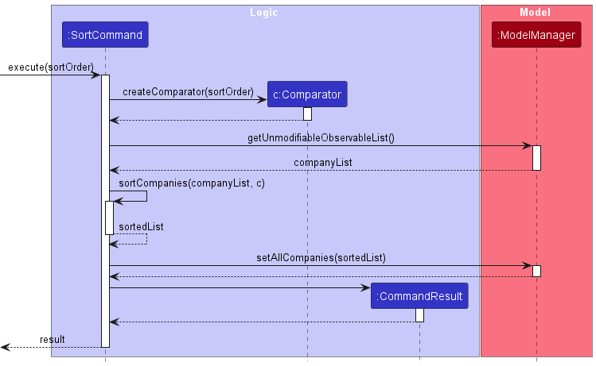
<div markdown="block" class="alert alert-info">
**:information_source: Note:**
The corresponding methods `createComparator`, `getUnmodifiableObservableList` and `sortCompanies` in the sequence diagram 
are simplifications of the actual code implementations for their respective actions. Also, the `sortOrder` is stored 
as an attribute in the `SortCommand` object, when it is created during parsing. It is shown as the way it is in the 
diagram for simplicity. 
</div>

---
<div style="page-break-after: always;"></div>

## **Documentation, Logging, Testing, Configuration, DevOps**

-   [Documentation guide](Documentation.md)
-   [Testing guide](Testing.md)
-   [Logging guide](Logging.md)
-   [Configuration guide](Configuration.md)
-   [DevOps guide](DevOps.md)

---
<div style="page-break-after: always;"></div>

## **Appendix A: Requirements**

### Product Scope

**Target User Profile**

National University of Singapore Computer Science students preparing for an internship who
-   prefer desktop apps over other types
-   can type quickly
-   prefer typing to mouse interactions
-   is reasonably comfortable using CLI apps

**Value Proposition** <br>
CS students often struggle to manage a multitude of internship applications and track their application progress. An intuitive CLI address book not only efficiently stores these applications but also offers a valuable tool for monitoring and organizing the entire application process, simplifying the pursuit of career opportunities.

<div style="page-break-after: always;"></div>

### User Stories

Priorities: High (must have) - `* * *`, Medium (nice to have) - `* *`, Low (unlikely to have) - `*`

| Priority | As a …​                         | I want to …​                                                 | So that I can…​                                                                            |
|----------|---------------------------------|--------------------------------------------------------------|--------------------------------------------------------------------------------------------|
| `* * *`  | user                            | add a new company to LinkMeIn                                | manage my internship applications for that company                                         |
| `* * *`  | thorough user                   | view the recruiter's information of a company                | follow up on my internship application                                                     |
| `* * *`  | tidy user                       | delete a company                                             | ensure my list of companies remains organised by removing those I no longer wish to manage |
| `* * *`  | user                            | list out all my companies                                    | have an overview of my internship applications                                             |
| `* *`    | careless user                   | edit the details of a company                                | rectify any typographical errors in the company details                                    |
| `* *`    | user managing many applications | find companies by their name                                 | locate details of companies without having to go through the entire list                   |
| `* *`    | user managing many applications | sort companies by application deadline                       | view applications with nearer or further deadlines easily to plan my schedule              |
| `* *`    | meticulous user                 | add remarks for a company                                    | keep track of specific notes, thoughts or important details related to that application    |
| `* *`    | meticulous user                 | remove remarks for a company                                 | remove irrelevant information and keep my remarks up to date                               |
| `* *`    | seasoned user                   | clear all data                                               | start afresh on a internship application cycle                                             |
| `* *`    | user                            | exit the app quickly                                         | conclude my session and ensure the application is not running in the background            |
| `* *`    | confused user                   | view a list of available CLI commands and their descriptions | learn more about the application's features                                                |
| `* *`    | new user                        | access a list of sample data                                 | test the application out                                                                   |
| `* *`    | seasoned user                   | filter companies by application status                       | focus on the most pertinent and relevant applications of interest                          |
| `* *`    | careless user                   | check for duplicate entries before adding an entry           | avoid redundancy and maintain an accurate representation of my internship applications     |
| `* `     | creative user                   | be able to change the theme of LinkMeIn                      | personalise the visual appearance of the interface based on my preferences                 |
| `*`      | new user                        | import data from excel file                                  | easily switch from excel to LinkMeIn and continue tracking my internship applications      |
| `*`      | new user                        | export data to excel file                                    | easily switch from LinkMeIn to excel and continue tracking my internship applications      |

<div style="page-break-after: always;"></div>

### Use Cases

<div markdown="block" class="alert alert-info">
**:information_source: Note:**<br>
For all use cases below, the **System** is `LinkMeIn` and the **Actor** is the `user`, unless specified otherwise.
</div>


**Use Case: UC01 - List all Companies**

**MSS** <br>
1. User requests to list all companies.
2. LinkMeIn displays the full list of companies. <br>
   Use case ends.

**Extensions** <br>
* 1a. LinkMeIn detects an invalid command format error in the input.
    * 1a1. LinkMeIn displays an error message.
    * 1a2. User enters a new command to list all companies. <br>
      Use case resumes from Step 1.


**Use Case: UC02 - Add a Company**

**MSS** <br>
1. User requests to add a company.
2. LinkMeIn adds the company. <br>
   Use case ends.

**Extensions** <br>
* 1a. LinkMeIn detects an invalid command format error in the input →  handled similarly to 1a of UC01.
* 1b. LinkMeIn detects an invalid parameter input.
    * 1b1. LinkMeIn displays an error message.
    * 1b2. User enters new data for the parameter. <br>
      Use case resumes from Step 1.
* 1c. User requests to add a duplicate company.
    * 1c1. LinkMeIn displays an error message.
    * 1c2. User enters the information of a new company. <br>
      Use case resumes from Step 1.


**Use Case: UC03 - Delete a Company**

**MSS** <br>
1. User requests to delete a specific company from the list of companies.
2. LinkMeIn deletes the company. <br>
   Use case ends.

**Extensions** <br>
* 1a. LinkMeIn detects an invalid index input.
    * 1a1. LinkMeIn displays an error message.
    * 1a2. User enters a new index. <br>
      Use case resumes from Step 1.

* 1b. LinkMeIn detects an invalid command format error in the input →  handled similarly to 1a of UC01.


**Use Case: UC04 - View a Company Detailed Information**

**MSS** <br>
1. User requests to view a specific company from the list of companies.
2. LinkMeIn shows the full information of the company in the company detail panel. <br>
   Use case ends.

**Extensions**
* 1a. LinkMeIn detects an invalid index input → handled similarly to 1a of UC03.
* 1b. LinkMeIn detects an invalid command format error in the input →  handled similarly to 1a of UC01.


**Use Case: UC05 - Clear all Companies**

**MSS** <br>
1. User requests to clear all companies from the full list of companies.
2. LinkMeIn clears all companies in the data. <br>
   Use case ends.

**Extensions** <br>
* 1a. LinkMeIn detects an invalid command format error in the input →  handled similarly to 1a of UC01.


**Use Case: UC06 - Edit a Company**

**MSS** <br>
1. User requests to edit parameter(s) of a specific company in the list.
2. LinkMeIn edits the company. <br>
   Use case ends.

**Extensions** <br>
* 1a. LinkMeIn detects an invalid index input → handled similarly to 1a of UC03.
* 1b. LinkMeIn detects an invalid command format error in the input →  handled similarly to 1a of UC01.
* 1c. User requests to edit to a duplicate company → handled similarly to 1c of UC02.


**Use Case: UC07 - Find a Company**

**MSS** <br>
1. User requests to find companies based on the keywords.
2. LinkMeIn displays a list of companies with matching keywords. <br>
   Use case ends.

**Extensions** <br>
* 1a. LinkMeIn detects an invalid command format error in the input →  handled similarly to 1a of UC01.


**Use Case: UC08 - Filter Companies by Application Status**

**MSS** <br>
1. User requests to filter the list of companies by one of the application statuses.
2. LinkMein displays a list of companies matching the application status. <br>
   Use case ends.

**Extensions** <br>
* 1a. LinkMeIn detects an invalid command format error in the input →  handled similarly to 1a of UC01.
* 1b. LinkMeIn detects an invalid parameter input → handled similarly to 1b of UC02.


**Use Case: UC09 - Sort Companies by Deadline**

**MSS** <br>
1. User requests to sort the list of companies by deadline.
2. LinkMeIn displays the sorted list of companies. <br>
   Use case ends.

**Extensions** <br>
* 1a. LinkMeIn detects an invalid command format error in the input →  handled similarly to 1a of UC01.
* 1b. LinkMeIn detects an invalid parameter input → handled similarly to 1b of UC02.


**Use Case: UC10 - Add Remarks for a Company**

**MSS** <br>
1. User requests to add remarks for a specific company.
2. LinkMeIn adds the remarks to the company. <br>
   Use case ends.

**Extensions** <br>
* 1a. LinkMeIn detects an invalid index input → handled similarly to 1a of UC03.


**Use Case: UC11 - Delete Remarks for a Company**

**MSS** <br>
1. User requests to delete remarks for a specific company from the list of companies.
2. LinkMeIn deletes the remarks from the company. <br>
   Use case ends.

**Extensions** <br>
* 1a. LinkMeIn detects an invalid index input → handled similarly to 1a of UC03.


**Use Case: UC12 - Exit the Program**

**MSS** <br>
1. User requests to exit the program.
2. LinkMeIn exits the program. <br>
   Use case ends.

**Extensions** <br>
* 1a. LinkMeIn detects an invalid command format error in the input →  handled similarly to 1a of UC01.


**Use Case: UC13 - View Help**

**MSS** <br>
1. User requests for help to use LinkMeIn.
2. LinkMeIn displays a window with a link to the user guide. <br>
   Use case ends.

**Extensions** <br>
* 1a. LinkMeIn detects an invalid command format error in the input →  handled similarly to 1a of UC01.

<div style="page-break-after: always;"></div>

### Non-Functional Requirements

1. The system should be available for download on our GitHub release page in the form of a JAR file.
2. The system should work on any mainstream OS as long as it has Java 11 or above installed.
3. The system should be able to hold up to 300 companies without a noticeable sluggishness in performance for typical usage.
4. The system should be a single-user application.
5. The response to any user input should become visible within 2 seconds.
6. A user with above average typing speed for regular English text (i.e. not code, not system admin commands) should be able to accomplish most of the tasks faster using commands than using the mouse.
7. The system should be easily picked up by a novice with no experience with managing internship applications.
8. Data should be stored locally in the device.
9. The application should guide the user if it fails to execute any of the user’s commands for various reasons.
10. The application should be packaged into a single JAR file with size not exceeding 100MB.
11. The code should meet the coding standard of CS2103T for maintainability.

<div style="page-break-after: always;"></div>

### Glossary

| Term                   | Definition                                                                                                                                                                                                                          |
|------------------------|-------------------------------------------------------------------------------------------------------------------------------------------------------------------------------------------------------------------------------------|
| **Alphanumeric**       | Refers to a character set that includes both letters and numbers. It includes the 26 letters of the English alphabet (both uppercase and lowercase) and the numbers 0 through 9.                                                    |
| **APPLICATION_STATUS** | Status of the application. It can be either pending application, pending interview, pending outcome, accepted or rejected.                                                                                                          |
| **CLI**                | Command-Line Interface (CLI) is a text-based user interface where users interact with the application by typing commands.                                                                                                           |
| **Command**            | A command is an instruction given by a user to LinkMeIn to perform a specific action. For example,`add` command is a command to add the company's application into LinkMeIn.                                                        |
| **COMPANY_NAME**       | Name of the company that you are applying to. Should only contain alphanumeric characters <br/>and spaces, and should not be blank. Maximum of 100 characters (excluding spaces).                                                   |
| **DEADLINE**           | Deadline of the application. Should be in DD-MM-YYYY format. Dates before the current date are allowed.                                                                                                                             |
| **EMAIL**              | Email of the recruiter. Should be in the format of `local-part@domain` and should not be blank.                                                                                                                                     |
| **GUI**                | Graphical User Interface (GUI) is a visual method to interact with software using icons, buttons, and windows. GUI provides a user-friendly way to interact with software using graphical elements rather than text-based commands. |
| **Index**              | Refers to the index number shown in the displayed company list.                                                                                                                                                                     |
| **JAR**                | JAR stands for Java Archive and is a package file format typically used to aggregate many Java class files and associated metadata and resources into one file for distribution.                                                    |
| **JSON**               | JSON stands for JavaScript Object Notation. It is a lightweight format for data interchange, easy to read and write for humans, and easy to parse for machines. Often used in web applications and configuration files.             |
| **Mainstream OS**      | Windows, Linux, Unix, OS-X.                                                                                                                                                                                                         |
| **Parameter**          | Parameter is similar to a field in a form you have to fill up. For example, in the command `edit 1 c/COMPANY_NAME e/EMAIL`, `COMPANY_NAME` and `EMAIL` are parameters in the command.                                               |
| **PHONE_NUMBER**       | Phone number of the recruiter. Should only contain numbers, be at least 3 digits and at most 20 digits long. Should not be blank.                                                                                                   |
| **Prefix**             | Prefix is a keyword that is used to identify the parameter. For example, in the command `edit 1 c/COMPANY_NAME e/EMAIL`, `c/` and `e/` are prefixes.                                                                                |
| **PRIORITY**           | Priority of the internship application for a company. Case-insensitive and should be one of the following: `high`, `medium`, `low`, `none`.                                                                                         |
| **RECRUITER_NAME**     | Name of the recruiter. Should only contain alphanumeric characters and spaces, and should not be blank. Maximum of 100 characters (excluding spaces).                                                                               |
| **REMARK**             | Refers to additional comments for the application. Should not be blank.                                                                                                                                                             |
| **ROLE**               | Role of the internship that you are applying. Should only contain alphanumeric characters and spaces, and should not be blank. Maximum of 100 characters (excluding spaces).                                                        |

---
<div style="page-break-after: always;"></div>

## **Appendix B: Planned Enhancements**

### More Specific Success Message for Company

**Feature Flaw in Current Implementation**

Currently, the success message for `view`, `edit`, `remark`, `unremark`, and `add` commands only displays the company name.
However, the duplicate check implemented in LinkMeIn uses 3 criteria, company name, role, and deadline. As such, there
can be more than one entry with the same company name. The user might want to know the role and deadline to
differentiate between applications with the same company name. As such, the current success message displayed can be confusing for the user as to which company specifically has been modified.

**Proposed Enhancement**

Instead of displaying only the company name, the success message will display the company name, role and deadline.
This will be the same implementation done for the existing `delete` command. As such, a method was already created in
the `Messages` class called `getCompanyInfo` where the company name, role and deadline from the company object will be
returned as a string.

The following implementation will be adopted instead:
`return new CommandResult(String.format(MESSAGE_SUCCESS, Messages.getCompanyInfo(toAdd)));`

**Examples**

- **view**: `Viewing company: COMPANY_NAME (ROLE, DEADLINE)`
- **edit**: `COMPANY_NAME (ROLE, DEADLINE) company edited.`
- **remark**: `Added remark to company: COMPANY_NAME (ROLE, DEADLINE)`
- **unremark**: `Removed remark from company: COMPANY_NAME (ROLE, DEADLINE)`
- **add**: `New company added: COMPANY_NAME (ROLE, DEADLINE)`

### Make Recruiter Name, Phone and Email Parameters Optional in Add Command
**Feature Flaw in Current Implementation** <br>
Currently, the recruiter’s information, namely recruiter’s name, phone number and email address, are compulsory parameters as inputs for Add Command. However, the user may not have the recruiter’s information at the point of applying to the company, which is common in most internship applications now. The user may only have the recruiter’s information at a later point in time. Hence, the user will not be able to add the company into LinkMeIn, without the recruiter's name, phone number and email address.

**Proposed Enhancement** <br>
Instead of having the recruiter's name, phone number and email address to be compulsory fields, they will be changed to optional parameters in the `add` Command. This will allow the user to add the company into LinkMeIn without the recruiter's information.

The updated `add` command format would be as follows:
`add c/COMPANY_NAME r/ROLE s/APPLICATION_STATUS d/DEADLINE [n/RECRUITER_NAME] [p/PHONE] [e/EMAIL] [pr/PRIORITY]`.

If the user did not add in the recruiter's name, phone number and email address upon adding the company into LinkMeIn, they can still do so with the existing `edit` command.

**Examples**<br>
* `add c/Google r/Software Engineer s/pa d/11-11-2023`
* `add c/TikTok r/Data Analyst s/pa d/10-12-2023 n/Ben Tan`

### Omit Alphanumeric Checks for Company Name, Recruiter Name and Role Parameters

### Enhanced Flexibility in Phone Number Parameter Input

**Feature Flaw in Current Implementation**

Currently, the phone number parameter only accepts integers as valid user inputs. However, users may encounter scenarios,
such as applying for overseas internships, where they want to include symbols like `()`, `+`,  `-` and `.` in the phone
number field. The current restriction prevents users from indicating country codes, potentially causing confusion about
the origin of the phone number.

**Proposed Enhancement**

The regex checking for a valid phone number will be changed to allow for `()`, `+`, `-` and `.` in the phone number
field. In addition, the character `+` will only be allowed at the start while, the other symbols have no positioning restrictions.

**Examples**

- +33 (0)6 12 34 56 78: will be accepted
- +33612345678: will be accepted
- 06.12.34.56.78: will be accepted
- 06-12-34-56-78: will be accepted
- 922492304: will be accepted
- 24234 + 234243: will **not** be accepted

### **5. Enhance Find Feature to Search with Other Parameters**
**Potential Flaw in Current Implementation**<br>
Currently, LinkMeIn only allows searching through the list of companies by the `COMPANY_NAME` parameter. However, 
users might want to search through the list using other parameters, like `RECRUITER_NAME`, `PRIORITY` and `ROLE`.

**Proposed Enhancement**<br>
We plan to expand the current find command’s capability to allow for search using other parameters. The users will 
be able to specify the prefix that corresponds to the parameter they wish to use for the search, before the keyword(s). 
The prefixes used will be consistent with the rest of the application, in regard to what parameter they represent.

Here are the new suggested formats :
* Find using `RECRUITER_NAME` : `find n/KEYWORD [KEYWORDS]...`
* Find using `PRIORITY`: `find pr/KEYWORD [KEYWORDS]...`
* Find using `Role`: `find r/KEYWORD [KEYWORDS]...`

**Examples**<br>
* `find n/John Doe`
* `find pr/High`
* `find r/Software Engineer`

### **6. Enhance Find Feature to Allow for Search of Exact Company Names**
**Potential Flaw in Current Implementation**<br>
If users would like to find a specific company that has two or more words in their name such as `Microsoft 
Corporation`, using the current find command will return companies that match either “Microsoft” or “Corporation”. 
This can potentially pollute the results and defeat the purpose of the find feature.

**Proposed Enhancement**<br>
We plan to expand the find command's capability, to allow for exact keyword matching. This can be done by specifying 
the keyword(s) within quotations.

Suggested command format for exact find: `find “KEYWORD [KEYWORDS]...”`

For example, users can now type: `find “Microsoft Corporation”`. This will return companies with names that match 
`Microsoft Corporation` exactly, reducing the potential for polluted find results.

### Improve Error Message for Deadline Parameter
**Potential Flaw in Current Implementation**<br>
Currently, users are able to input deadline past the current date successfully. We have allowed this in our current implementation because we understand that some users would like to track internship applications even if they have passed, but still belong in that internship cycle.

However, some users might perceive it as a lack of validation check in LinkMeIn to inform them about an incorrectly entered deadline input.

**Proposed Enhancement**<br>
To enhance the deadline parameter input, we will add a check to determine if the input deadline has already passed. If the deadline is before the current date, the user will still be able to add or edit the deadline. However, instead of the success message being `New company added: COMPANY_NAME`, we will improve the success message to be:
```
New company added: COMPANY_NAME. 
Note that you have entered a deadline past the current date. If you made a mistake in your input, please use the `edit` command to update the deadline. 
```

### Enhance Flexibility in Deadline Parameter Input
**Potential Flaw in Current Implementation**<br>
Currently, users are constrained to adhere strictly to the DD-MM-YYYY format for inputting deadline parameters. This rigid format might be inconvenient for some users, who prefer different date formats, which are equally common.

**Proposed Enhancement**<br>
To enhance user flexibility and accommodate various user preferences, we will allow multiple deadline formats. Instead of accepting only DD-MM-YYYY format, we will also accept DD/MM/YYYY, YYYY/MM/DD and YYYY-MM-DD formats.

Also, we understand that some users may not wish to type leading zeros for days and months with leading zeros, D/M/YYYY, D-M-YYYY, YYYY-M-D and YYYY/M/D formats will also be accepted.

**Examples**
* 1/1/2024 is in D/M/YYYY format
* 2024-1-1 is in YYYY-M-D format
* 12/12/2023 is in DD/MM/YYYY format

### Allow Multiple Indices Input for Delete Command

**Feature Flaw in Current Implementation**

Currently, the user can only delete one company at once. However, there will be cases where the user wish to delete multiple entries at once, especially if the user wishes to delete all the companies that he got rejected from. This can be tedious and inconvenient for the user.

**Proposed Enhancement**

Enable the user to input multiple indices when attempting to delete entries. Users can separate each index with a comma.
The `DeleteCommandParser` will then split the string by commas and remove the companies corresponding to the specified indices. There will also be checks to see if the user keyed in the same index more than once. If the same index is keyed in more than once, the parser will accept the input but treat it as if the user only keyed in that same index once.

**Examples**

- `delete 1, 2`: deletes companies at index 1 and 2
- `delete 1`: deletes company at index 1
- `delete 4, 3, 7, 2`: deletes companies at index 4, 3, 7, 2

### Enhance Remark Feature
**Potential Flaw in Current Implementation**

Currently, users are unable to copy texts from the company detail panel in our UI.
If users wish to add on to the existing remark, they need to re-type the existing remark into the command box then add in the new remark.
This may not be a practical implementation, especially if the existing remark is long, which affects user experience negatively.

**Proposed Enhancement**

Edit the error message returned for `remark INDEX re/`.
Currently, when `remark 1 re/` is entered, the error message returned is `Oops! Remark should not be empty. Please try again!`.
This can be enhanced to return the existing remarks in the Message Box where the user can copy the content unlike in the company detail panel where the user is unable to do so.
Hence, the `remark INDEX re/` command is modified such that if the user does not enter any remarks after `re/` prefix, the message displayed to the user will include their existing remarks.
Should they wish to add on to their existing remarks, they can easily copy their existing remarks from the Message Box.
The success message for a valid cumulative remark command will be the same as the usual remark command, which is `Added remark to Company: COMPANY_NAME`.

**Examples**
* Google is the first company in the list and the user wants to add remarks cumulatively.

When `remark 1 re/` is entered, the Message Box will display the following message.
```
Remarks in Google:
Require experience in Java, Interview on 12/12/2023
```
The user can copy from the Message Box and add on to his remarks. A sample input of an updated remark will then be: 

`remark 1 re/Require experience in Java, Interview on 12/12/2023, Interview went well!`

---
<div style="page-break-after: always;"></div>

## **Appendix C: Instructions for Manual Testing**

Given below are instructions to test the app manually.

<div markdown="span" class="alert alert-info">:information_source: **Note:** These instructions only provide a starting point for testers to work on;
testers are expected to do more *exploratory* testing.

</div>

### Launch and Shutdown
1. Initial launch
    1. Download the jar file and copy into an empty folder.
    2. Run `java -jar LinkMeIn.jar` in the folder containing the jar file to launch LinkMeIn. <br>
       Expected: Shows the GUI with a set of sample companies. The window size may not be optimum.
2. Saving window preferences
    1. Resize the window to an optimum size. Move the window to a different location. Close the window.
    2. Re-launch LinkMeIn.<br>
       Expected: The most recent window size and location is retained.

### Adding a Company
1. Test case: `add c/Google r/Software Engineer s/PA d/10-10-2023 n/Francis Tan p/98765432 e/johnd@example.com pr/HIGH` <br>
   Expected: A new company is added to the end of the list of companies. Details of the added company is displayed in the company detail panel.
2. Test case: `add c/Google r/Software Engineer s/PA d/10-10-2023 n/Francis Tan` <br>
   Expected: No company is added. Error details shown in the command message.
3. Try adding the same test case from Step 1. Check that an error message is displayed.

### Editing a Company
Prerequisite: There is at least one company in the list.

1. Test case: `edit 1 r/Data Analyst` <br>
   Expected: First company’s role is updated in the list. Details of the edited company is displayed in the company detail panel.
2. Try editing other companies with different parameters.

### Deleting a Company
Prerequisite: There is at least one company in the list.

1. Test case: `delete 1`<br>
   Expected: First contact is deleted from the list. Details of the deleted company shown in the message box.

2. Test case: `delete 0`<br>
   Expected: No company is deleted. Error details shown in the message box.

3. Other incorrect delete commands to try: `delete`, `delete x`, `...` (where x is larger than the list size)<br>
   Expected: Similar to previous.

### Viewing a Company
Prerequisites: List all companies using the `list` command. Multiple companies in the list.

1. Test case: `view 1`<br>
   Expected: First company is shown in the company detail panel.
2. Test case: `view 0`<br>
   Expected: No company is shown in the company detail panel. Error details shown in the message box.
3. Other incorrect view commands to try: `view`, `view x`, `...` (where x is larger than the list size)<br>
   Expected: Similar to previous.


### Adding Remarks to a Company
Prerequisite: There is at least one company in the list.

1. Test case: `remark 1 r/This is a remark` <br>
   Expected: Remarks are added to the first company in the list.
2. Try adding remarks to a company with an index greater than the number of companies in the current list. Check that an error message is displayed and no remarks are added.

### Deleting Remarks from a Company
Prerequisite: There is at least one company in the list.

1. Test case: `unremark 1` <br>
   Expected: Remarks deleted from the first company in the list. Company detail panel will display "No remarks" under Remarks.

### Listing Companies
1. Test case: `list` <br>
   Expected: All companies in the list are displayed in the company list panel.

### Finding Companies
1. Test case: `find Google` <br>
   Expected: All companies with the keyword "Google" in their names are displayed in the company list panel.
2. Try finding for a company that does not exist in the list.
   Expected: No company is displayed in the company list panel.

### Sorting Companies by Deadline
1. Test case: `sort` <br>
   Expected: All companies in the list are displayed in the company list panel, sorted by deadline in ascending order.
2. Test case: `sort d` <br>
   Expected: All companies in the list are displayed in the company list panel, sorted by deadline in descending order.
3. Try sorting companies by an invalid parameter. Check that an error message is displayed.

### Filtering Companies by Application Status
1. Test case: `filter s/PA` <br>
   Expected: All companies with the application status "PA" are displayed in the company list panel.
2. Try again with an invalid application status. Check that an error message is displayed.

### Clearing All Data
1. Test case: `clear` <br>
   Expected: All companies are deleted from the list.

### Exiting LinkMeIn
1. Test case: `exit` <br>
   Expected: LinkMeIn closes.


### Saving Data
1. Dealing with missing data file
    1. Delete the file named `companydata.json` located in the `data` folder.
    2. Relaunch LinkMeIn. <br>
       Expected: A new `companydata.json` file is created in the `data` folder, with sample companies shown in the GUI.
2. Dealing with corrupted data file
    1. Open the `companydata.json` file located in the `data` folder with a text editor.
    2. Corrupt the file by deleting a few characters. Save the file.
    3. Relaunch LinkMeIn. <br>
       Expected: No companies will be shown in LinkMeIn.

<div style="page-break-after: always;"></div>

## **Appendix D: Effort**
