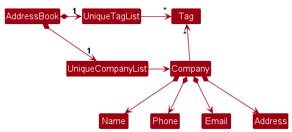
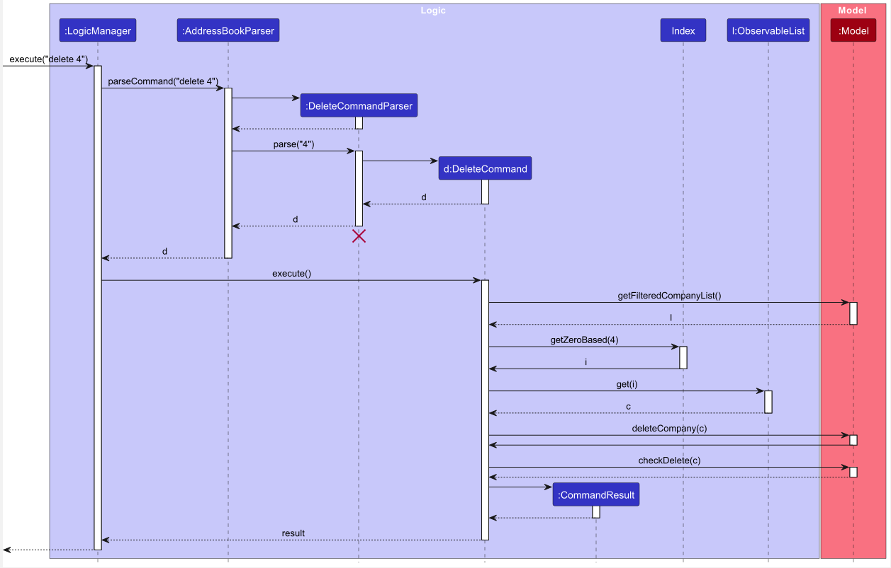

-   Table of Contents
    {:toc}

---

## 1. **Acknowledgements**

### Adapted code and documentation

This project is based on the AddressBook-Level3 project created by the [SE-EDU initiative](https://se-education.org).

### Third party libraries

-   [Checkstyle](https://checkstyle.sourceforge.io/) - Checkstyle is a development tool to help programmers write Java code that adheres to a coding standard.
-   [Codecov](https://codecov.io/) - Codecov is a code coverage tool.
-   [Gradle](https://gradle.org/) - Gradle is an open-source build automation tool that is designed to be flexible enough to build almost any type of software.
-   [Jackson](https://github.com/FasterXML/jackson) - Jackson is a multipurpose Java library for processing JSON data format.
-   [Jacoco](https://docs.gradle.org/current/userguide/jacoco_plugin.html) - JaCoCo is a free code coverage library for Java, which has been created by the EclEmma team based on the lessons learned from using and integration existing libraries for many years.
-   [JavaFX](https://openjfx.io/) - JavaFX is a software platform for creating and delivering desktop applications, as well as rich Internet applications (RIAs) that can run across a wide variety of devices.
-   [JavaFX CSS](https://docs.oracle.com/javafx/2/api/javafx/scene/doc-files/cssref.html) - JavaFX CSS is a simple CSS parser.
-   [JavaFX FXML](https://docs.oracle.com/javafx/2/fxml_get_started/jfxpub-fxml_get_started.htm) - JavaFX FXML is an XML-based language that provides the structure for building a user interface separate from the application logic of your code.
-   [JavaFX Scene Builder](https://gluonhq.com/products/scene-builder/) - JavaFX Scene Builder is a visual layout tool that lets users quickly design JavaFX application user interfaces, without coding.
-   [JUnit](https://junit.org/junit5/) - JUnit is a unit testing framework for the Java programming language.
-   [PlantUML](https://plantuml.com/) - PlantUML is an open-source tool allowing users to create UML diagrams from a plain text language.

---

## 2. **Setting up, getting started**

Refer to the guide [_Setting up and getting started_](SettingUp.md).

---

## 3. **Design**

:bulb: **Tip:** The `.puml` files used to create diagrams in this document `docs/diagrams` folder. Refer to the [_PlantUML Tutorial_ at se-edu/guides](https://se-education.org/guides/tutorials/plantUml.html) to learn how to create and edit diagrams.

### 3.1 Architecture

The **_Architecture Diagram_** given above explains the high-level design of the App.

Given below is a quick overview of main components and how they interact with each other.

**Main components of the architecture**

**`Main`** (consisting of classes [`Main`](https://github.com/se-edu/addressbook-level3/tree/master/src/main/java/seedu/address/Main.java) and [`MainApp`](https://github.com/se-edu/addressbook-level3/tree/master/src/main/java/seedu/address/MainApp.java)) is in charge of the app launch and shut down.

-   At app launch, it initializes the other components in the correct sequence, and connects them up with each other.
-   At shut down, it shuts down the other components and invokes cleanup methods where necessary.

The bulk of the app's work is done by the following four components:

-   [**`UI`**](#ui-component): The UI of the App.
-   [**`Logic`**](#logic-component): The command executor.
-   [**`Model`**](#model-component): Holds the data of the App in memory.
-   [**`Storage`**](#storage-component): Reads data from, and writes data to, the hard disk.

[**`Commons`**](#common-classes) represents a collection of classes used by multiple other components.

**How the architecture components interact with each other**

The _Sequence Diagram_ below shows how the components interact with each other for the scenario where the user issues the command `delete 1`.

Each of the four main components (also shown in the diagram above),
-   defines its _API_ in an `interface` with the same name as the Component.
-   implements its functionality using a concrete `{Component Name}Manager` class (which follows the corresponding API `interface` mentioned in the previous point.

For example, the `Logic` component defines its API in the `Logic.java` interface and implements its functionality using the `LogicManager.java` class which follows the `Logic` interface. Other components interact with a given component through its interface rather than the concrete class (reason: to prevent outside component's being coupled to the implementation of a component), as illustrated in the (partial) class diagram below.

The sections below give more details of each component.

### 3.2 UI component

The **API** of this component is specified in [`Ui.java`](https://github.com/se-edu/addressbook-level3/tree/master/src/main/java/seedu/address/ui/Ui.java)

The UI consists of a `MainWindow` that is made up of parts e.g.`CommandBox`, `ResultDisplay`, `CompanyListPanel`, `CompanyDetailPanel`, `StatusBarFooter` etc. All these, including the `MainWindow`, inherit from the abstract `UiPart` class which captures the commonalities between classes that represent parts of the visible GUI.

The `UI` component uses the JavaFx UI framework. The layout of these UI parts are defined in matching `.fxml` files that are in the `src/main/resources/view` folder. For example, the layout of the [`MainWindow`](https://github.com/se-edu/addressbook-level3/tree/master/src/main/java/seedu/address/ui/MainWindow.java) is specified in [`MainWindow.fxml`](https://github.com/se-edu/addressbook-level3/tree/master/src/main/resources/view/MainWindow.fxml)

The `UI` component,

-   executes user commands using the `Logic` component.
-   listens for changes to `Model` data so that the UI can be updated with the modified data.
-   keeps a reference to the `Logic` component, because the `UI` relies on the `Logic` to execute commands.
-   depends on some classes in the `Model` component, as it displays `Person` object residing in the `Model`.

### 3.3 Logic component

**API** : [`Logic.java`](https://github.com/se-edu/addressbook-level3/tree/master/src/main/java/seedu/address/logic/Logic.java)

Here's a (partial) class diagram of the `Logic` component:

The sequence diagram below illustrates the interactions within the `Logic` component, taking `execute("delete 1")` API call as an example.

:information_source: **Note:** The lifeline for `DeleteCommandParser` should end at the destroy marker (X) but due to a limitation of PlantUML, the lifeline reaches the end of diagram.

How the `Logic` component works:

1. When `Logic` is called upon to execute a command, it is passed to an `AddressBookParser` object which in turn creates a parser that matches the command (e.g., `DeleteCommandParser`) and uses it to parse the command.
2. This results in a `Command` object (more precisely, an object of one of its subclasses e.g., `DeleteCommand`) which is executed by the `LogicManager`.
3. The command can communicate with the `Model` when it is executed (e.g. to delete a company).
4. The result of the command execution is encapsulated as a `CommandResult` object which is returned back from `Logic`.

Here are the other classes in `Logic` (omitted from the class diagram above) that are used for parsing a user command:

How the parsing works:

-   When called upon to parse a user command, the `AddressBookParser` class creates an `XYZCommandParser` (`XYZ` is a placeholder for the specific command name e.g., `AddCommandParser`) which uses the other classes shown above to parse the user command and create a `XYZCommand` object (e.g., `AddCommand`) which the `AddressBookParser` returns back as a `Command` object.
-   All `XYZCommandParser` classes (e.g., `AddCommandParser`, `DeleteCommandParser`, ...) inherit from the `Parser` interface so that they can be treated similarly where possible e.g, during testing.

### 3.4 Model component

**API** : [`Model.java`](https://github.com/se-edu/addressbook-level3/tree/master/src/main/java/seedu/address/model/Model.java)

The `Model` component,

-   stores the address book data i.e., all `Company` objects (which are contained in a `UniqueCompanyList` object).
-   stores the currently 'selected' `Company` objects (e.g., results of a search query) as a separate _filtered_ list
    which is exposed to outsiders as an unmodifiable `ObservableList<Company>` that can be 'observed' e.g. the UI can be
    bound to this list so that the UI automatically updates when the data in the list change.
-   stores a `UserPref` object that represents the user’s preferences. This is exposed to the outside as a `ReadOnlyUserPref` objects.
-   does not depend on any of the other three components (as the `Model` represents data entities of the domain, they should make sense on their own without depending on other components)

:information_source: **Note:** An alternative (arguably, a more OOP) model is given below. It has a `Tag` list in the `AddressBook`, which `Person` references. This allows `AddressBook` to only require one `Tag` object per unique tag, instead of each `Person` needing their own `Tag` objects. 

### 3.5 Storage component

**API** : [`Storage.java`](https://github.com/se-edu/addressbook-level3/tree/master/src/main/java/seedu/address/storage/Storage.java)

The `Storage` component,

-   can save both address book data and user preference data in JSON format, and read them back into corresponding objects.
-   inherits from both `AddressBookStorage` and `UserPrefStorage`, which means it can be treated as either one (if only the functionality of only one is needed).
-   depends on some classes in the `Model` component (because the `Storage` component's job is to save/retrieve objects that belong to the `Model`)

### 3.6 Common classes

Classes used by multiple components are in the `seedu.addressbook.commons` package.

---

## 4. **Implementation**

This section describes some noteworthy details on how certain features are implemented.

### 4.1 Company detail panel (UI component)

The `CompanyDetailPanel` allows user to view the company details of the selected company in the company list.
The user can use the `view` command to select the company to view.

#### 4.1.1 Implementation

The company detail panel UI component is achieved by creating a new `UniqueCompanyList` in `AddressBook` to
store the selected company which the user wishes to view. Additionally, the following operations are implemented in
`AddressBook` to support the `view` and other commands:

-   `setCurrentViewedCompany(Company company)` - Sets the selected company to be viewed.
-   `clearDetailPanel()` - Clears the `UniqueCompanyList` to remove the selected company from the company detail panel.

These operations are exposed in the `Model` interface as `Model#setCurrentViewedCompany(Company company)` and
`Model#checkDelete()` respectively.

The `view` function is implemented in the `ViewCommand` class which calls `Model#setCurrentViewedCopany(Company company)`
to insert the selected company into the `UniqueCompanyList`.
The follow sequence diagram depicts how the `view` command is executed.

Since only the detail of one company will be displayed anytime, `Model#setCurrentViewedCopany(Company company)` will
clear the `UniqueCompanyList` before inserting the selected company.
Since `UniqueCompanyList` is an observable list, the `CompanyDetailPanel` will be updated automatically
when there is any changes made to the `UniqueCompanyList`

When the `edit`, `add`, `view` or `delete` command is executed, the `CompanyDetailPanel` will be updated respectively as
shown in the activity diagram below.

#### 4.1.2 Design Considerations

**Aspect: How details of the company is displayed**

-   **Alternative 1 (current choice):** Display the details of the company in a separate panel.

    -   Pros: The information is well compartmentalized. This improves the user viewing experience.
    -   Cons: More commands are needed to view the details of the company.

-   **Alternative 2:** Display the details of the company in the same panel as the company list.
    -   Pros: User does not need to key in additional commands to view the details of the company.
    -   Cons: The company list panel will be too cluttered with too much information displayed in a company card.

**Aspect: How the company to be viewed is stored in the `AddressBook`**

-   **Alternative 1 (current choice):** Create a new `UniqueCompanyList` in `AddressBook` to store the selected company which the user wishes to view.

    -   Pros: Since the `UniqueCompanyList` is an observable list, the `CompanyDetailPanel` will be updated automatically when there is any changes made to the `UniqueCompanyList`.
    -   Cons: There is a need to clear the list before adding the selected company to the `UniqueCompanyList` to ensure that only one company is displayed in the `CompanyDetailPanel` at any time.

-   **Alternative 2:** Create a new `Company` object in `AddressBook` to store the selected company which the user wishes to view.
    -   Pros: It is intuitive to create a new `Company` object to store the selected company which the user wishes to view.
    -   Cons: The `CompanyDetailPanel` will not be updated automatically when there is any changes made to the `Company`
        object. There is a need to create additional methods to update the `CompanyDetailPanel` when there is any changes
        made to the `Company` object.

### 4.2 Find command

#### 4.2.1 Implementation

The `find` command allows users to search for companies using one or more keywords. Companies matching any of the keywords in their names will be returned. This search is case-insensitive, and partial matches are valid. The critical change in the implementation centers around the modification of the `NameContainsKeywordsPredicate` class.

##### How `NameContainsKeywordsPredicate` Works:

Previously, `NameContainsKeywordsPredicate` was designed to match a company name against a whole keyword. However, the modified implementation allows it to test a company's name against substrings and return true if the comapany's name contains the substring .

When `find` is executed, it uses the `Model` interface's `updateFilteredCompanyList(Predicate<Company> predicate)` method, passing in the modified `NameContainsKeywordsPredicate` to filter the list of companies.

The sequence diagram below illustrates the processing of a `find` command, such as `find Micr`:

> :information_source: **Note:** The above sequence diagram simplifies the interaction by focusing on the primary components involved in processing the `find` command.

#### 4.2.2 Design considerations:

**Aspect: Approach to matching keywords**

-   **Alternative 1 (current choice):** Match company names that contain the keyword **anywhere** within them.

    -   Pros: Flexible search, allows partial keyword matching.
    -   Cons: Might produce more results than expected.

-   **Alternative 2:** Match company names that **start** with the given keyword.

    -   Pros: Precise results.
    -   Cons: Might omit some relevant results if user does not remember the exact start of the company's name.

**Aspect: Case-sensitivity**

-   **Alternative 1 (current choice):** Case-insensitive matching.

    -   Pros: User-friendly; users don’t need to remember exact case.
    -   Cons: Might produce a broader range of results.

-   **Alternative 2:** Case-sensitive matching.

    -   Pros: More exact matches.
    -   Cons: Less user-friendly, especially if users do not recall the exact case of company names.

With the design considerations, we've chosen the alternatives that provide a balance between user-friendliness and precision.

### 4.3 Filter Command

The `filter` command allows user to filter the company list by the application status. The following sequence diagram
will illustrate the process of performing the `filter` command.

#### 4.3.1 Implementation

The `filter` function is implemented in the `FilterCommand` class and uses the `FilterCommandParser` class to parse the
arguments. The predicate class implementing `Predicate<Company>` is `ApplicationStatusPredicate`.
- `ApplicationStatusPredicate` - Predicate to check if the company's application status is the same as the application
  status specified in the command.

#### 4.3.2 Design Considerations

**Aspect: UI of the filter command**

- **Alternative 1 (current choice):** The company details panel will be cleared whenever the filter command is executed.
    - Pros: Users can focus on viewing details of company belonging to the filtered list only, reducing distractions and confusions.
    - Cons: Users might have to execute the `view` command again to access details of the company that is selected even
      if that company is in the filtered list, potentially leading to additional steps.

- **Alternative 2:** The company details panel will still display the details of the company that was selected before the
  filter command is executed.
    - Pros: Users can still view the details of the company in the company details panel alongside the filtered list of companies.
    - Cons: Users may be confused as the currently viewed company in the company details panel may not be in the
      filtered list of companies.

### 4.4 Edit feature

#### 4.4.1 Implementation
The edit mechanism is facilitated by `EditCompanyDescriptor`. It is a nested class of `EditCommand` that stores the edited fields of a company and unedited fields to be `null`.
Additionally, `EditCommand` implements the following operations:

* `EditCommand#execute(Model model)` — Edits all the attributes indicated in user input.

These operations are exposed in the `Model` interface as `Model#setCompany(Company target, Company editedCompany)`.

Given below is the sequence diagram shows how the edit operation works.

After the `EditCommandParser` initializes an `EditCompanyDescriptor` object, it sets the attributes of `EditCompanyDescriptor` that needs to be edited to the values input by the user.
When `EditCommand#execute()` is called, a `Company` object, `c`, with edited attributes is initialized since `Company` is immutable.
When `Model#setCompany(Company company)` is called, the original `Company` object in the `AddressBook` is replaced with the edited Company `c`.

#### 4.4.2 Design considerations:

**Aspect: How to edit different attributes of a company**

* **Alternative 1 (current choice):** Edits all attributes using one command.
    * Pros: Easy to implement.
    * Cons: More prone to errors and bugs/ require more test cases for code coverage.

* **Alternative 2:** Have a command to edit each attribute.
    * Pros: Command line is shorter which reduces users' error such as duplicates or invalid command. This improves user experience.
    * Cons: We must ensure that the implementation of each individual command are correct. This may also require more memory usage, a Company object is initialized for every modified attribute.

### 4.5 Delete Command

The `delete` command allows user to delete a company using the observed index (one-based index) of the company.
The following sequence diagram will illustrate the process of performing the `delete` command.

#### 4.5.1 Implementation

The `delete` function is implemented in the `DeleteCommand` class and uses the `DeleteCommandParser` class to parse the
arguments. The LogicManger#execute() method will retrieve the filtered company list from the model, perform zero-based
indexing to the supplied Index, get the company associated with the index and requests model to `delete` the company.

#### 4.5.2 Design Considerations
**Aspect: Coupling between `DeleteCommand` and `FilterCommand`**
- **Alternative:** The delete function can be performed by the `DeleteCommand` class without having to
  retrieve the filtered company list from the model.
    - Pros: The `DeleteCommand` class will be simpler and easier to understand.
    - Cons: The `DeleteCommand` class will be tightly coupled with the `FilterCommand` class.

**Aspect: Type of company deletion input from the user**
- **Alternative:** Instead of one-based index input from the user, require the user to enter the company name
  to be deleted.
    - Pros: The user does not need to remember the index of the company to be deleted.
    - Cons: The user may enter the wrong company name to be deleted.

### \[Proposed\] Undo/redo feature

#### Proposed Implementation

The proposed undo/redo mechanism is facilitated by `VersionedAddressBook`. It extends `AddressBook` with an undo/redo history, stored internally as an `addressBookStateList` and `currentStatePointer`. Additionally, it implements the following operations:

-   `VersionedAddressBook#commit()` — Saves the current address book state in its history.
-   `VersionedAddressBook#undo()` — Restores the previous address book state from its history.
-   `VersionedAddressBook#redo()` — Restores a previously undone address book state from its history.

These operations are exposed in the `Model` interface as `Model#commitAddressBook()`, `Model#undoAddressBook()` and `Model#redoAddressBook()` respectively.

Given below is an example usage scenario and how the undo/redo mechanism behaves at each step.

Step 1. The user launches the application for the first time. The `VersionedAddressBook` will be initialized with the initial address book state, and the `currentStatePointer` pointing to that single address book state.

Step 2. The user executes `delete 5` command to delete the 5th company in the address book. The `delete` command calls `Model#commitAddressBook()`, causing the modified state of the address book after the `delete 5` command executes to be saved in the `addressBookStateList`, and the `currentStatePointer` is shifted to the newly inserted address book state.

Step 3. The user executes `add n/David …​` to add a new company. The `add` command also calls `Model#commitAddressBook()`, causing another modified address book state to be saved into the `addressBookStateList`.

:information_source: **Note:** If a command fails its execution, it will not call `Model#commitAddressBook()`, so the address book state will not be saved into the `addressBookStateList`.

Step 4. The user now decides that adding the company was a mistake, and decides to undo that action by executing the `undo` command. The `undo` command will call `Model#undoAddressBook()`, which will shift the `currentStatePointer` once to the left, pointing it to the previous address book state, and restores the address book to that state.

:information_source: **Note:** If the `currentStatePointer` is at index 0, pointing to the initial AddressBook state, then there are no previous AddressBook states to restore. The `undo` command uses `Model#canUndoAddressBook()` to check if this is the case. If so, it will return an error to the user rather
than attempting to perform the undo.

The following sequence diagram shows how the undo operation works:

:information_source: **Note:** The lifeline for `UndoCommand` should end at the destroy marker (X) but due to a limitation of PlantUML, the lifeline reaches the end of diagram.

The `redo` command does the opposite — it calls `Model#redoAddressBook()`, which shifts the `currentStatePointer` once to the right, pointing to the previously undone state, and restores the address book to that state.

:information_source: **Note:** If the `currentStatePointer` is at index `addressBookStateList.size() - 1`, pointing to the latest address book state, then there are no undone AddressBook states to restore. The `redo` command uses `Model#canRedoAddressBook()` to check if this is the case. If so, it will return an error to the user rather than attempting to perform the redo.

Step 5. The user then decides to execute the command `list`. Commands that do not modify the address book, such as `list`, will usually not call `Model#commitAddressBook()`, `Model#undoAddressBook()` or `Model#redoAddressBook()`. Thus, the `addressBookStateList` remains unchanged.

Step 6. The user executes `clear`, which calls `Model#commitAddressBook()`. Since the `currentStatePointer` is not pointing at the end of the `addressBookStateList`, all address book states after the `currentStatePointer` will be purged. Reason: It no longer makes sense to redo the `add n/David …​` command. This is the behavior that most modern desktop applications follow.

The following activity diagram summarizes what happens when a user executes a new command:

#### Design considerations:

**Aspect: How undo & redo executes:**

-   **Alternative 1 (current choice):** Saves the entire address book.

    -   Pros: Easy to implement.
    -   Cons: May have performance issues in terms of memory usage.

-   **Alternative 2:** Individual command knows how to undo/redo by
    itself.
    -   Pros: Will use less memory (e.g. for `delete`, just save the company being deleted).
    -   Cons: We must ensure that the implementation of each individual command are correct.

_{more aspects and alternatives to be added}_

### \[Proposed\] Data archiving

_{Explain here how the data archiving feature will be implemented}_

---

## **Documentation, logging, testing, configuration, dev-ops**

-   [Documentation guide](Documentation.md)
-   [Testing guide](Testing.md)
-   [Logging guide](Logging.md)
-   [Configuration guide](Configuration.md)
-   [DevOps guide](DevOps.md)

---

## **Appendix: Requirements**

### Product scope

**Target user profile**:

-   Computer Science students preparing for an internship or job application
-   prefer desktop apps over other types
-   can type quickly
-   prefers typing to mouse interactions
-   is reasonably comfortable using CLI apps

**Value proposition**: CS students often struggle to manage a multitude of internship contacts and track their application progress.
A CLI address book not only efficiently stores these connections but also offers a valuable tool for monitoring and organizing the entire
application process, simplifying the pursuit of career opportunities.

### User stories

Priorities: High (must have) - `* * *`, Medium (nice to have) - `* *`, Low (unlikely to have) - `*`

| Priority | As a …​                                      | I want to …​                 | So that I can…​                                                          |
|----------|----------------------------------------------|------------------------------|--------------------------------------------------------------------------|
| `* * *`  | new user                                     | see usage instructions       | refer to instructions when I forget how to use the App                   |
| `* * *`  | user                                         | add a new company            |                                                                          |
| `* * *`  | user                                         | delete a company             | remove entries that I no longer need                                     |
| `* * *`  | user                                         | find a company by name       | locate details of companies without having to go through the entire list |
| `* *`    | user                                         | hide private contact details | minimize chance of someone else seeing them by accident                  |
| `*`      | user with many companies in the address book | sort companies by name       | locate a company easily                                                  |

_{More to be added}_

### Use cases

(For all use cases below, the **System** is the `AddressBook` and the **Actor** is the `user`, unless specified otherwise)

**Use case: Delete a company**

**MSS**

1.  User requests to list companies
2.  AddressBook shows a list of companies
3.  User requests to delete a specific company in the list
4.  AddressBook deletes the company

    Use case ends.

**Extensions**

-   2a. The list is empty.

    Use case ends.

-   3a. The given index is invalid.

    -   3a1. AddressBook shows an error message.

        Use case resumes at step 2.

-   3b. User is viewing the details of the company to be deleted.

    -   3b1. AddressBook clears the company details panel.

        Use case resumes at step 4.

**Use case: Find a Company**

**MSS**

1. User requests to find a company by name.
2. AddressBook shows a list of companies whose names contain the given keywords.

    Use case ends.

**Extensions**

-   2a. The list is empty.

    Use case ends.

-   2b. The given keywords do not match any company name.

    -   2b1. AddressBook shows an empty list.

        Use case ends.

-   2c. The given keywords match multiple company names.

    -   2c1. AddressBook shows a list of companies whose names contain the given keywords.

        Use case ends.

**Use case: Add a company**

**MSS**

1. User requests to add a company.
2. User key in required field and information.
3. AddressBook adds the company.
4. AddressBook shows the company detail of the added company in the company detail panel.

    Use case ends.

**Extensions**

-   2a. User key in invalid information.

    -   2a1. AddressBook shows an error message.

        Use case resumes at step 2.

**Use case: List company**

**MSS**

1. User requests to list companies.
2. AddressBook shows a list of companies.

    Use case ends.

**Extensions**

-   2a. The list is empty.

    Use case ends.

**Use case: View full company information**

**MSS**

1. User requests to list companies.
2. AddressBook shows a list of companies.
3. User requests to view a specific company in the list.
4. AddressBook shows the full information of the company in the company detail panel.

    Use case ends.

**Extensions**

-   2a. The list is empty.

    Use case ends.

-   3a. The given index is invalid.

    -   3a1. AddressBook shows an error message.

        Use case resumes at step 2.

### Non-Functional Requirements

1. The system should be available for download on our GitHub release page in the form of a JAR file.
2. The system should work on any _mainstream OS_ as long as it has Java `11` or above installed.
3. The system should be able to hold up to 200 applications to companies without a noticeable sluggishness in performance for typical usage.
4. The response to any user input should become visible within 2 seconds.
5. A user with above average typing speed for regular English text (i.e. not code, not system admin commands) should be able to accomplish most of the tasks faster using commands than using the mouse.
6. Most of the commands should be easy to remember so that a new user can learn to use the system quickly.
7. Data should be stored locally in the device (i.e. user can access the file through the system or directly from the device).
8. The code should meet the coding standard of CS2103T for maintainability.

### Glossary

-   **Company**: A company that is offering an internship position
-   **Internship application**: An application made by the user to a company offering an internship position
-   **Mainstream OS**: Windows, Linux, Unix, OS-X

---

## **Appendix: Instructions for manual testing**

Given below are instructions to test the app manually.

:information_source: **Note:** These instructions only provide a starting point for testers to work on;
testers are expected to do more *exploratory* testing.

### Launch and shutdown

1. Initial launch

    1. Download the jar file and copy into an empty folder

    2. Double-click the jar file Expected: Shows the GUI with a set of sample contacts. The window size may not be optimum.

2. Saving window preferences

    1. Resize the window to an optimum size. Move the window to a different location. Close the window.

    2. Re-launch the app by double-clicking the jar file. 
       Expected: The most recent window size and location is retained.

3. _{ more test cases …​ }_

### Deleting a company

1. Deleting a company while all companies are being shown

    1. Prerequisites: List all companies using the `list` command. Multiple companies in the list.

    2. Test case: `delete 1` 
       Expected: First contact is deleted from the list. Details of the deleted contact shown in the status message. Timestamp in the status bar is updated.

    3. Test case: `delete 0` 
       Expected: No company is deleted. Error details shown in the status message. Status bar remains the same.

    4. Other incorrect delete commands to try: `delete`, `delete x`, `...` (where x is larger than the list size) 
       Expected: Similar to previous.

2. _{ more test cases …​ }_

### Saving data

1. Dealing with missing/corrupted data files

    1. _{explain how to simulate a missing/corrupted file, and the expected behavior}_

2. _{ more test cases …​ }_
