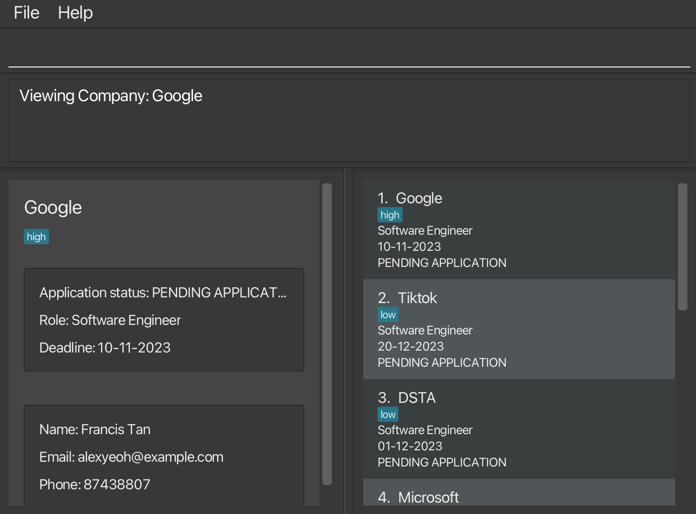
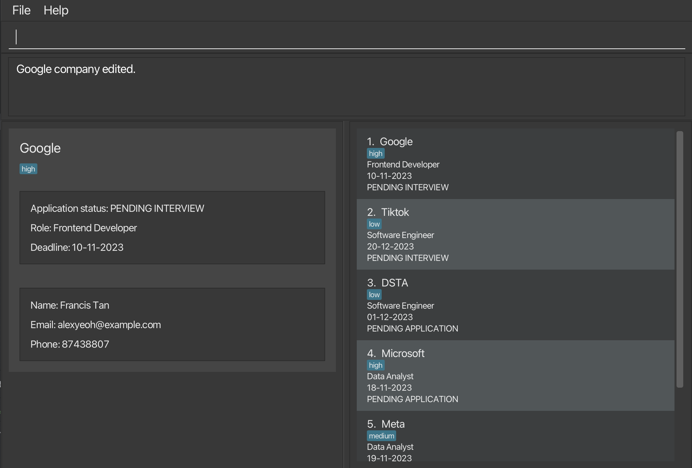

Never miss an internships interview with LinkMeIn! Keep track of all your deadlines in an organised fashion. 

* Table of Contents for the User Guide
{:toc}

--------------------------------------------------------------------------------------------------------------------

## Quick start ##

1. Product only runs on Java 11

2. Refer to the [Features](#features) below for details of each command.

--------------------------------------------------------------------------------------------------------------------

## Current Features ##

<div markdown="block" class="alert alert-info">

**:information_source: Notes about the command format:**<br>
    Yet to be updated.

</div>
### Adding a company: `add` ###

Adds a company to the address book.
The company must have the required fields:
CompanyName, ApplyingRole, ApplicationStatus, RecruiterName, Deadline(DD-MM-YYYY).
Order of input **does not** matter.

| Prefix | Application Status     |
|--------|------------------------|
| PA     | PENDING APPLICATION    |
| PI     | PENDING INTERVIEW      |
| PO     | PENDING OUTCOME        |
| A      | ACCEPTED               |
| R      | REJECTED               |

**Format**:</br>
`add c/COMPANY_NAME n/RECRUITER_NAME r/ROLE
a/APPLICATION_STATUS d/DEADLINE [e/EMAIL] [p/PHONE_NUMBER]`

**Examples**:
* `add c/Tiktok n/John Tan r/Software Engineer a/PA d/11-11-2023 e/johntan@example.com p/987654321`
* `add c/Google n/Mary r/Data Analyst a/R d/11-11-2023`
* `add c/Google r/Data Scientist a/PI n/Mary d/11-11-2023  e/mary@example.com`

**Acceptable values for each parameter:**<br>
No other string separators other than c/, n/, r/, a/, d/, e/, p/.
Otherwise, the **entire** command will be considered invalid and all data inputted will be discarded.

Example: `c/Google n/Mary r/Data Analyst a/R d/11-11-2023 f/`</br> Explanation: Invalid f/ string separator.

**Expected output when command succeeds**: </br>
`{COMPANY_NAME} contact added to the list!`

**GUI Changes:** </br>
The company should be added to the existing list of companies on the right.

**Expected output when command fails:** </br>

* If the COMPANY_NAME field is missing:
`Invalid command format! Missing COMPANY_NAME. Format is add c/COMPANY_NAME
n/RECRUITER_NAME r/ROLE a/APPLICATION_STATUS [e/EMAIL] [p/PHONE_NUMBER]`
</br>
</br>
* If the RECRUITER_NAME field is missing:
`Invalid command format! Missing RECRUITER_NAME. Format is add c/COMPANY_NAME n/RECRUITER_NAME
r/ROLE a/APPLICATION_STATUS [e/EMAIL] [p/PHONE_NUMBER]`
</br>
</br>
* If the APPLICATION_STATUS field is missing:
`Invalid command format! Missing RECRUITER_NAME. Format is add
c/COMPANY_NAME n/RECRUITER_NAME r/ROLE a/APPLICATION_STATUS [e/EMAIL] [p/PHONE_NUMBER]`
</br>
</br>
* If the ROLE field is missing:
`Invalid command format! Missing RECRUITER_NAME. Format is add c/COMPANY_NAME
n/RECRUITER_NAME r/ROLE a/APPLICATION_STATUS [e/EMAIL] [p/PHONE_NUMBER]`

**Expected UI**


### Listing all contacts : `list`

Lists all the contacts in the application at present.

**Format:** `list`

**Examples:** `list`

**Expected UI**:


The list of companies should be listed in the following format below:
```
{COMPANY_NAME 1} {ROLE}

{COMPANY_NAME 2} {ROLE}

{COMPANY_NAME 3} {ROLE}
```
### Deleting a company : `delete` ###

Deletes a company from the address book.

**Format:`delete INDEX`**

* Deletes the contact at the specific INDEX
* The index refers to the index number shown in the displayed contact list
* The index must be a positive integer

**Examples:**
* `list` followed by `delete 1` deletes the first contact in the full list
* `find` TikTok followed by `delete 1` deletes the first contact in the results of find TikTok

**Acceptable values for each parameter:**
* INDEX must be a number. If not the entire command will be considered invalid input.
* INDEX must not be out of bounds. If not the entire command will be considered invalid input.
* INDEX must be more than zero. If not the entire command will be considered invalid input.

**Expected output when command succeeds:**
```
“{COMPANY_NAME} application record has been deleted!
You have __ contacts in the list.”
```

**GUI Changes:** </br>
Company at specified index removed and list of companies updated

**Expected output when command fails:**
</br>
If INDEX is out of bounds:
</br>
`The company index provided is invalid`

If INDEX is zero or negative:
</br>
`Invalid command format`
`delete: Deletes the company identified by the index number used in the displayed company list.`
`Parameters: INDEX (must be a positive integer)`

If INDEX is not a number: </br>
`Invalid command format`
`delete: Deletes the company identified by the index number used in the displayed company list.`
`Parameters: INDEX (must be a positive integer)`

**Expected UI**


### View full company information: `view` ###
View the full company information of a particular company on the left panel.

**Format:** `view INDEX`

**Examples:**
* `view 1` displays application details of the first company in the full list
* `view 2` displays application details of the second company in the full list

**Acceptable values for each parameter:**
* INDEX must be a number. If not the entire command will be considered invalid input.
* INDEX must not be out of bounds. If not the entire command will be considered invalid input.
* INDEX must be more than zero. If not the entire command will be considered invalid input.

**Expected output when command succeeds:**</br>
`Viewing Company: {COMPANY_NAME}`

**GUI Changes:** </br>
The company’s information should be listed on the left panel, which includes the following fields:

1. COMPANY_NAME 
2. APPLICATION_STATUS
3. ROLE
4. DEADLINE
5. RECRUITER_NAME
6. EMAIL 
7. PHONE
8. PRIORITY

**Expected output when command fails:** </br>

* If INDEX is out of bounds: </br>
`The company index provided is invalid`
* If INDEX is zero or negative: </br>
  `Invalid command format`
  `view: Views the company identified by the index number used in the displayed company list.`
  `Parameters: INDEX (must be a positive integer)`
* If INDEX is not a number: </br>
  `Invalid command format`
  `view: Views the company identified by the index number used in the displayed company list.`
  `Parameters: INDEX (must be a positive integer)`

**Expected UI**



### Edit a company's information: `edit` ###
Edits the information of a particular company.

**Format:** `edit INDEX [c/COMPANY_NAME] [n/RECRUITER_NAME] [r/ROLE] [s/APPLICATION_STATUS] [d/DEADLINE] [e/EMAIL] [p/PHONE_NUMBER] [t/TAG]…`

* Edits the company at the specified INDEX. The index refers to the index number shown in the displayed company list. The index must be a positive integer 1, 2, 3, ...
* At least one of the optional fields must be provided.
* Existing values will be updated to the input values.
* When editing tags, the existing tags of the company will be removed i.e adding of tags is not cumulative.
* You can remove all the company’s tags by typing t/ without specifying any tags after it.

**Examples:**
* `edit 2 s/Pending Application r/frontend developer` edits the status and role of the 2nd person to be Pending Application and frontend developer respectively.
* `edit 3 e/example@abc.com t/` edits the email of the 3rd person to be example@abc.com and clears all existing tags.

**Acceptable values for each parameter:**
* INDEX must be a number. If not the entire command will be considered invalid input.
* INDEX must not be out of bounds. If not the entire command will be considered invalid input.
* INDEX must be more than zero. If not the entire command will be considered invalid input.
* No other string separators other than c/, n/, r/, s/, d/, e/, p/. Otherwise, the entire command will be considered invalid and all data inputted will be discarded.

**Expected output when command succeeds:**</br>
`{COMPANY_NAME} company edited.`

**Expected output when command fails:** </br>
* If INDEX is out of bounds: </br>
  `The company index provided is invalid`
* If invalid string separator: </br>
  `Invalid command format! edit: Edits the details of the company identified by the index number used in the displayed company list. Existing values will be overwritten by the input values.
  Parameters: INDEX (must be a positive integer) [c/COMPANY_NAME] [n/RECRUITER_NAME] [r/ROLE] [s/APPLICATION_STATUS] [d/DEADLINE] [e/EMAIL] [p/PHONE] [t/TAG]...
  Example: edit 1 p/91234567 e/johndoe@example.com`
* If empty input after string separator: </br>
  `Please enter a valid {field}`

**Expected UI** <br/>


## Upcoming Features ##

TBD

--------------------------------------------------------------------------------------------------------------------

## FAQ ##

TBD.

--------------------------------------------------------------------------------------------------------------------

## Known issues ##

TBD.
--------------------------------------------------------------------------------------------------------------------

## Command summary ##

| Action     | Format, Examples                                                                                                                                                                                                         |
|------------|--------------------------------------------------------------------------------------------------------------------------------------------------------------------------------------------------------------------------|
| **Add**    | `add c/COMPANY_NAME n/RECRUITER_NAME r/ROLE a/APPLICATION_STATUS d/DEADLINE [e/EMAIL] [p/PHONE_NUMBER]` <br><br> e.g., `add c/Tiktok n/John Tan r/Software Engineer a/PA d/11-11-2023 e/johntan@example.com p/987654321` |
| **Delete** | `delete INDEX`<br><br> e.g., `delete 3`                                                                                                                                                                                  |
| **View**   | `view INDEX`<br><br> e.g., `view 3`                                                                                                                                                                                      |
| **Edit**   | `edit INDEX [c/COMPANY_NAME] [n/RECRUITER_NAME] [r/ROLE] [a/APPLICATION_STATUS] [d/DEADLINE] [e/EMAIL] [p/PHONE_NUMBER] [t/TAG]…` <br/><br/> e.g., `edit 2 s/Pending Application r/frontend developer`                   |
