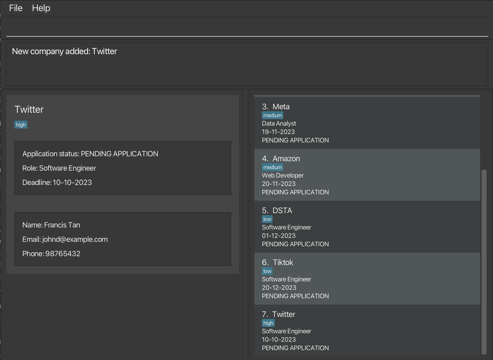
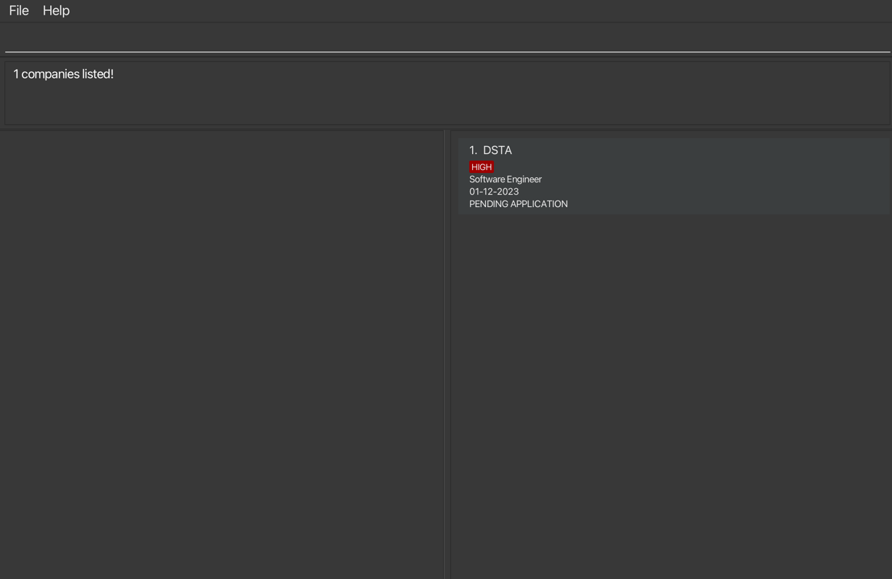
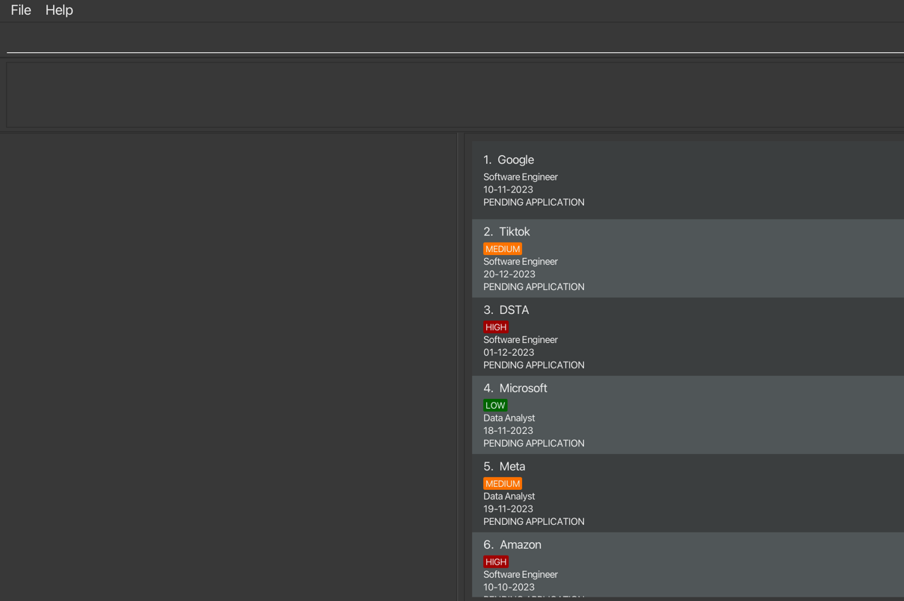
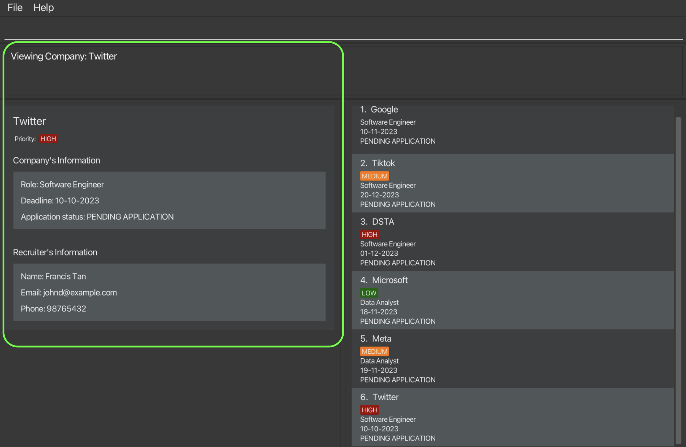
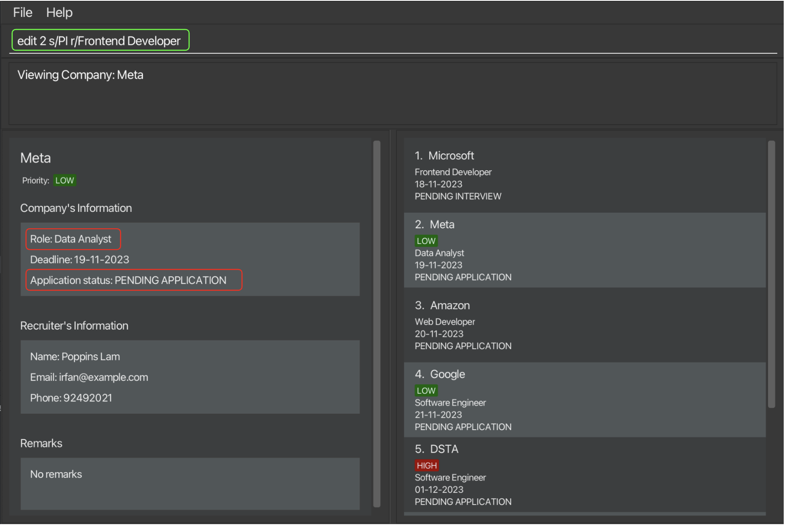
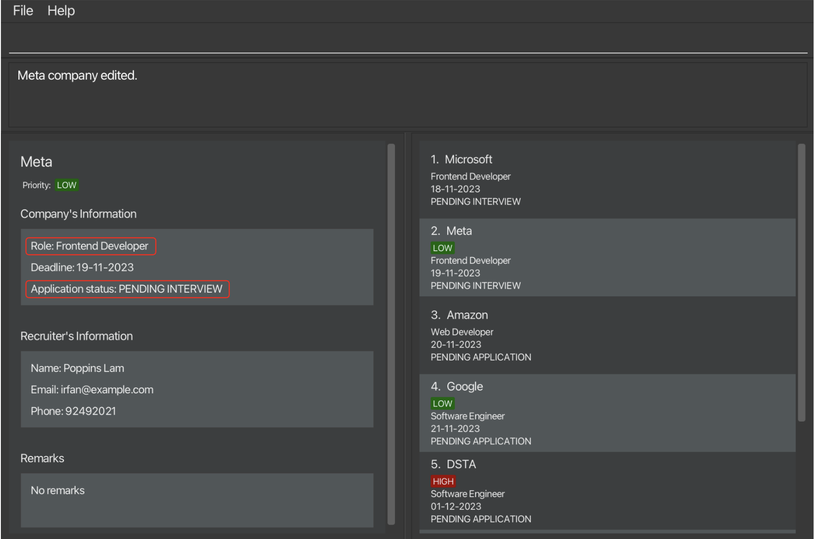

## Welcome to LinkMeIn!

_Master Your Internship Journey: Every Deadline, Every Detail._

LinkMeIn is a **desktop application** built for [NUS School Of Computing (SOC) students](https://www.comp.nus.edu.sg/) to
track their internship applications. It is recommended that you read this manual before using the application.

Here is a **quick** overview of your internship journey with LinkMeIn:
<br>
* **Effortless** Tracking: Seamlessly store internship listings, adjust details with changing circumstances, and swiftly recall past applications by date.
  <br>
  </br>
* Stay Empowered and **Informed**: Dive into specific application details when needed and access guidance with a click, ensuring you're always confident in your next step.
  <br>
  </br>
* Share and **Simplify**: After landing that internship, de-clutter your list and easily locate company details to guide your peers in their own searches.
  </br>


Additionally, LinkMeIn combines the rapid **efficiency** of CLI with the visual clarity of GUI,
offering a **tailored** experience for internship management that outpaces the generic
spreadsheets of Excel.

## Navigating the user guide

### Typographic conventions

<div class="typography-box warning">

> :warning: **Warning** - Alerts users to potential pitfalls or things to be cautious of when using your application.

</div>

<div class="typography-box tip">

> :bulb: **Tip** - Provides users with additional insights or more efficient ways to use your application.

</div>

<div class="typography-box note">

> :information_source: **Note** - Highlights supplementary information that users should be aware of, but isn't necessarily mission-critical.

</div>

<div class="typography-box code">

> :black_nib: **Code** - Indicates commands or programming-related content that can be typed or referred to.

</div>


### Non-typographic conventions
For the feature section, each page follows a predictable syntax and style.
<br>
</br>
Proceed to explain ... [TODO]

## Table of Contents


## Quick start

1. Make sure that you have **Java 11 or above** installed in your Computer.

  - [How to check if you have Java installed?](#faq-1)
  - [How to check if you have Java 11 or above?](#faq-2)

2. Download the latest jar file from [here]()

3. Copy the file to the folder you want to use as the home folder for your LinkMeIn.

  - Create a new folder (you can name it LinkMeIn) where you would like to house the application
    (e.g., Desktop, Documents, etc.)
  - Move the downloaded jar file as shown:

    - For Windows users
    - For Mac users

4. Launch LinkMeIn

  - For Windows users

    - Double-click on the `LinkMeIn.jar` file to launch the application

  - For Mac users

    - Open up your terminal (Command +Space > type Terminal > Enter)
    - Navigate to the folder where you have placed the jar file with the `cd` command
    - For example if you have placed the jar file in the Documents folder, type `cd Documents` and press Enter

<div class="typography-box warning">

> :warning: **Warning:** Do not move or delete the `data` folder as it contains the data of your applications.

</div>


You should notice the GUI of the application pop up.
1. Learn more about navigating the GUI [here]().
2. For new users, learn to use LinkMeIn [here]().
3. For advanced users, view all feature details [here]().
--------------------------------------------------------------------------------------------------------------------

## Current Features ##

### Adding a company : `add` ###

You scroll through your LinkedIn feed and see a company that you are interested in. 
You want to start on the application later, but you are afraid that you will forget about it. 
Add the company to LinkMeIn to keep track of the application process using the `add` command!

**Format**:
`add c/COMPANY_NAME r/ROLE s/APPLICATION_STATUS d/DEADLINE n/RECRUITER_NAME e/EMAIL p/PHONE_NUMBER [pr/priority]`

**Examples**:
* `add c/Tiktok r/Software Engineer s/PA n/John Tan d/10-10-2023 e/johntan@example.com p/987654321` adds a Company with 
the information provided into LinkMeIn. 
* `add c/Google n/Mary r/Data Analyst s/R d/11-11-2023 e/johntan@example.com p/987654321 pr/high`adds a Company with
  the information provided into LinkMeIn.

**Note**: 
* Compulsory fields include COMPANY_NAME, RECRUITER_NAME, ROLE, APPLICATION_STATUS, EMAIL and PHONE_NUMBER.
* PRIORITY is optional. If not specified, the default priority is `none`.
* Order of input **does not** matter.
* DEADLINE should be in DD-MM-YYYY format. 
* PRIORITY should be one of the following: `high`, `medium`, `low`, `none`. PRIORITY is case-insensitive. 
* APPLICATION_STATUS should be one of the following: `PA`, `PI`, `PO`, `A`, `R`. APPLICATION_STATUS is case-insensitive. 
The table below shows the meaning of each status.

| Prefix | Application Status     |
|--------|------------------------|
| PA     | PENDING APPLICATION    |
| PI     | PENDING INTERVIEW      |
| PO     | PENDING OUTCOME        |
| A      | ACCEPTED               |
| R      | REJECTED               |

**Format**:</br>
`add c/COMPANY_NAME r/ROLE s/APPLICATION_STATUS d/DEADLINE n/RECRUITER_NAME e/EMAIL p/PHONE_NUMBER [t/tags]`

**Examples**:
* `add c/Tiktok r/Software Engineer s/PA n/John Tan d/10-10-2023 e/johntan@example.com p/987654321`
* `add c/Google n/Mary r/Data Analyst s/R d/11-11-2023 e/johntan@example.com p/987654321 t/high`
* `add c/Meta r/Data Scientist s/PI n/Mary d/12-12-2023 e/mary@example.com p/91234567`

**Acceptable values for each parameter:**<br>
No other string separators other than c/, n/, r/, s/, d/, e/, p/, t/.
Otherwise, the **entire** command will be considered invalid and all data inputted will be discarded.

Example of invalid input: `c/Google n/Mary r/Data Analyst a/R d/11-11-2023 f/`</br>
Explanation: Invalid f/ string separator.

**Expected output when command succeeds**: </br>
`New company added: {COMPANY_NAME}`

**GUI Changes:** </br>
The company should be added to the existing list of companies on the right.</br>
The company’s information should also be listed on the left panel, which displays all the added fields information.

**Expected output when command fails:** </br>
`Invalid command format!`</br>
`add: Adds a company to the address book. Parameters: c/COMPANY_NAME r/ROLE s/STATUS d/DEADLINE n/RECRUITER_NAME p/PHONE e/EMAIL [t/TAG]...`</br>
`Example: add c/Google r/Software Engineer s/PA d/10-10-2023 n/Francis Tan p/98765432 e/johnd@example.com t/high`

***To be further updated in V1.3***
* If the COMPANY_NAME field is missing:
  `Invalid command format! Missing COMPANY_NAME. Format is add c/COMPANY_NAME
  n/RECRUITER_NAME r/ROLE a/APPLICATION_STATUS e/EMAIL p/PHONE_NUMBER`
  </br>
  </br>
* If the RECRUITER_NAME field is missing:
  `Invalid command format! Missing RECRUITER_NAME. Format is add c/COMPANY_NAME n/RECRUITER_NAME
  r/ROLE a/APPLICATION_STATUS [e/EMAIL] [p/PHONE_NUMBER]`
  </br>
  </br>
* If the APPLICATION_STATUS field is missing:
  `Invalid command format! Missing RECRUITER_NAME. Format is add
  c/COMPANY_NAME n/RECRUITER_NAME r/ROLE a/APPLICATION_STATUS [e/EMAIL] [p/PHONE_NUMBER]`
  </br>
  </br>
* If the ROLE field is missing:
  `Invalid command format! Missing RECRUITER_NAME. Format is add c/COMPANY_NAME
  n/RECRUITER_NAME r/ROLE a/APPLICATION_STATUS [e/EMAIL] [p/PHONE_NUMBER]`

**Expected UI:**



### Listing all contacts : `list`

Want to see all of your applications in one list? You can do so with the `list` command!

**Format:** `list`

**Examples:** 
- `filter s/PI` followed by `list` changes from showing only applications with status "Pending Interview".
to all companies added in LinkMeIn.

**What you will see before `list` command succeeds:**


**What you will see after `list` command succeeds:**

 

> Note: 
> - Whenever LinkMeIn is started, the list of companies on the right is what you will see after the `list` command is executed. 
> - Typical use case for `list` command is to change the current list of companies that is being viewed back to the 
full list of companies added in LinkMeIn.


### Find a company: `find` ###

**Format:** `find KEYWORD [MORE_KEYWORDS]...`

You wish to find a specific company in the list of companies. You can use the find command to find the
company that you are looking for. The find command allows you to find the company whose name contain any of the
given keywords.

- The search is case-insensitive. e.g `tiktok` will match `TikTok`.
- The order of the keywords does not matter. e.g. `tiktok google` will match `Google TikTok`.
- Only the company name is searched.
- Only full words will be matched e.g. `tik` will not match `tiktok`.
- Only companies with names that contain all the keywords will be returned e.g. `tiktok google` will match `Google TikTok` but not `TikTok`.

**Examples:**
* `find TikTok` returns `TikTok`
* `find TikTok Google` returns `TikTok Google`

**What you will see when command succeeds:**




### View full company information: `view` ###

You look at the list of companies and you see a company that has not been getting back to you. You can use the view 
command to view the company's recruiter's contact details to follow up with them. The view command allows you to view
the company detail of any company from the list of companies that you have added.

**Format:** `view INDEX`

* The index refers to the index number shown in the displayed company list.
* The index must be a positive integer.
* The index must not be out of bounds.
* You can only view one company at a time.

**Example:**
* `view 1` displays application details of the first company in the full list

**What you will see before `view` command succeeds:**



**What you will see after `view` command succeeds:**



The company’s information should be listed on the left panel and you will see the following fields:
1. COMPANY_NAME 
2. PRIORITY
3. ROLE
4. DEADLINE
5. APPLICATION_STATUS
6. RECRUITER_NAME
7. EMAIL 
8. PHONE


### Deleting a company : `delete` ###

Whether you accidentally added a company or no longer want to track it, don't worry LinkMeIn got you covered.
You can use the delete command to delete the company from the list of companies that you have added.

**Format:`delete INDEX`**

* The index refers to the index number shown in the displayed company list.
* The index must be a positive integer.
* The index must not be out of bounds.
* You can only delete one company at a time.

>
> Note: If you are viewing the details of the company that you are deleting, the details panel will be cleared too.


### Edit a company's information: `edit` ###
If you made a typo or need to update the progress of application,
use the `edit` command to input the accurate details.

**Format:** `edit INDEX [c/COMPANY_NAME] [n/RECRUITER_NAME] [r/ROLE] [s/APPLICATION_STATUS] [d/DEADLINE] [e/EMAIL] 
[p/PHONE_NUMBER] [pr/PRIORITY] [nt/NOTE]`

* `INDEX`: Edits the company at INDEX number shown in the displayed company list.
* `[c/COMPANY_NAME]` etc. : type prefix `c/` followed by new company name to edit company name.
* At least one of the optional fields must be provided.

:warning: When editing the note, the existing note of the company will be removed i.e adding of note is not cumulative.

**Examples:** </br>
1.Type `edit 2 s/PI r/Frontend Developer` 


2.The 2nd company's the status and role is edited to be Pending Interview and Frontend Developer respectively.




### Clear all entries: `clear` ###
Clears all entries of internship application.

**Format:** `clear`

:warning: Entries cannot be recovered after clearing.

### Exit LinkMeIn: `exit` ###
Exits the program and closes the window.

**Format:** `exit`


### Filter companies by application status: `filter` ###
Can't remember which applications you haven't submitted or want to prepare for the companies that have offered you an interview? 
Filter the list of companies by their application status using the `filter` command!

**Format:** `filter s/APPLICATION_STATUS`

**Examples:**
* `list` followed by`filter s/PI` filters the list of companies to show only companies with status "Pending Interview".

> Note: APPLICATION_STATUS should be one of the following: `PA`, `PI`, `PO`, `A`, `R`. APPLICATION_STATUS is case-insensitive.

**What you will see before `filter` command succeeds:**


**What you will see after `filter` command succeeds:**


## Upcoming Features ##

TBD

--------------------------------------------------------------------------------------------------------------------

## Glossary ##

| Term       | Definition                                                                                                                                                                                                                    |
|------------|-------------------------------------------------------------------------------------------------------------------------------------------------------------------------------------------------------------------------------|
| **CLI**    | Command-Line Interface. A method to interact with the software using textual commands. It's a text-based interface where users input commands directly to control the software.                                               |
| **GUI**    | Graphical User Interface. A visual method to interact with software using icons, buttons, and windows. Provides a user-friendly way to interact with software using graphical elements rather than text-based commands.        |
| **PA**     | Pending Application. Refers to an application that has been submitted but hasn't received any feedback or update yet. It's in the initial stage of the internship application process.                                       |
| **PI**     | Pending Interview. Indicates that the application has been reviewed, and the candidate is awaiting an interview. It signifies the next step after the initial application.                                                   |
| **PO**     | Pending Outcome. After the interview, the application is in this state. It means that the interview has been conducted, but the final decision or outcome (whether accepted or rejected) hasn't been communicated yet.        |
| **A**      | Accepted. This status means that the application has been approved and the candidate has been offered the internship position.                                                                                                |
| **R**      | Rejected. Unfortunately, this means that the application wasn't successful and the candidate won't be proceeding further in the internship process.                                                                            |


--------------------------------------------------------------------------------------------------------------------

## FAQ ##
### 1. How do I check if I have Java installed? ###

* Open up your terminal and type `java -version`. If you have Java installed, you should see something like this:
```
java version "
OpenJDK Runtime Environment (build
OpenJDK 64-Bit Server VM (build
```

* If you do not have Java installed, you can download it [here](https://www.oracle.com/sg/java/technologies/javase-downloads.html).
* If you are using Windows, you can refer to this [guide](https://www.java.com/en/download/help/windows_manual_download.html) to install Java.
* If you are using Mac, you can refer to this [guide](https://www.java.com/en/download/help/mac_install.html) to install Java.
* If you are using Linux, you can refer to this [guide](https://www.java.com/en/download/help/linux_x64_install.html) to install Java.
* If you are using Ubuntu, you can refer to this [guide](https://www.digitalocean.com/community/tutorials/how-to-install-java-with-apt-on-ubuntu-20-04) to install Java.

### 2. How do I check if I have Java 11 or above? ###
Open up your terminal and type `java -version`. If you have Java 11 or above installed, you should see something like this:
``` 
openjdk version "
OpenJDK Runtime Environment (build
OpenJDK 64-Bit Server VM (build
```
### 3. How do I load data from another computer? ###
Delete the `addressbook.json` file (stored at `[JAR file location]/data/addressbook.json`) from the computer that you wish to use LinkMeIn on. Then, copy over the `addressbook.json` file from the computer which you no longer wish to use LinkMeIn on. After which, boot up LinkMeIn to check whether your doctor information is properly loaded into the new computer.

### 4. Why am I unable to run LinkMeIn?  ###
Make sure you have Java 11 installed on your machine as the product only runs on Java 11.

### 5. How can I add priority to my internship application details? ### 
When adding a new company, use the `pr/` prefix followed by the priority value. For instance, `pr/high` to set the priority to high.

### 6. How do I load data from another computer? ### 
Delete the `addressbook.json` file (stored at `[JAR file location]/data/addressbook.json`) from the computer that you wish to use LinkMeIn on. Then, copy over the `addressbook.json` file from the computer which you no longer wish to use LinkMeIn on. After which, boot up LinkMeIn to check whether your doctor information is properly loaded into the new computer.

### 7. Why am I unable to run LinkMeIn? ### 
Make sure you have Java 11 installed on your machine as the product only runs on Java 11.

### 8. How can I add priority to my internship application details? ### 
When adding a new company, use the `pr/` prefix followed by the priority value. For instance, `pr/high` to set the priority to high.

--------------------------------------------------------------------------------------------------------------------

## Known issues ##

TBD.
--------------------------------------------------------------------------------------------------------------------

## Command Summary ##

| Command     | Format                                                                           | Example                                                                                                          |
|-------------|----------------------------------------------------------------------------------|------------------------------------------------------------------------------------------------------------------|
| `add`       | `add c/COMPANY_NAME r/ROLE s/APPLICATION_STATUS d/DEADLINE n/RECRUITER_NAME e/EMAIL p/PHONE_NUMBER [pr/priority]` | `add c/Tiktok r/Software Engineer s/PA n/John Tan d/10-10-2023 e/johntan@example.com p/987654321`              |
| `list`      | `list`                                                                           | `list`                                                                                                           |
| `find`      | `find KEYWORD [MORE_KEYWORDS]...`                                                 | `find TikTok`                                                                                                   |
| `view`      | `view INDEX`                                                                     | `view 1`                                                                                                        |
| `delete`    | `delete INDEX`                                                                   | `delete 1`                                                                                                      |
| `edit`      | `edit INDEX [c/COMPANY_NAME] [n/RECRUITER_NAME] [r/ROLE] [s/APPLICATION_STATUS] [d/DEADLINE] [e/EMAIL] [p/PHONE_NUMBER] [pr/PRIORITY] [nt/NOTE]` | `edit 2 s/PI r/Frontend Developer`                                                |

