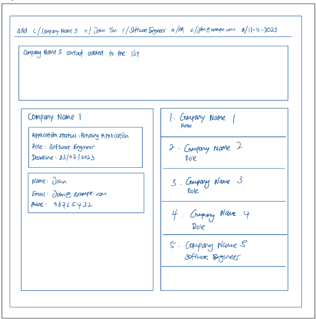
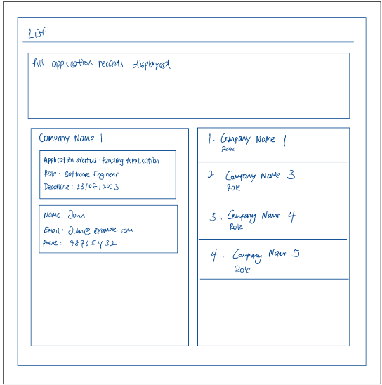
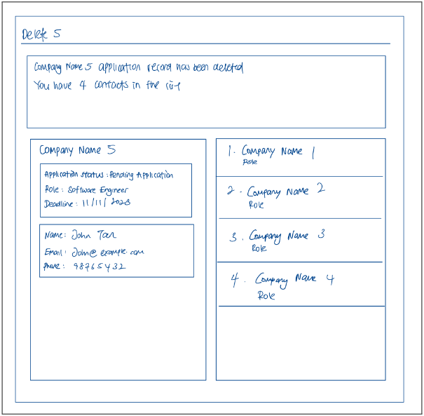

AddressBook Level 3 (AB3) is a **desktop app for managing contacts, optimized for use via a Command Line Interface** (CLI) while still having the benefits of a Graphical User Interface (GUI). If you can type fast, AB3 can get your contact management tasks done faster than traditional GUI apps.

* Table of Contents
{:toc}

--------------------------------------------------------------------------------------------------------------------

## Quick start ##

1. Ensure you have Java `11` or above installed in your Computer.

2. Download the latest `addressbook.jar` from [here](https://github.com/se-edu/addressbook-level3/releases).

3. Copy the file to the folder you want to use as the _home folder_ for your AddressBook.

4. Open a command terminal, `cd` into the folder you put the jar file in, and use the `java -jar addressbook.jar` command to run the application.<br>
   A GUI similar to the below should appear in a few seconds. Note how the app contains some sample data.<br>

5. Type the command in the command box and press Enter to execute it. e.g. typing **`help`** and pressing Enter will open the help window.<br>
   Some example commands you can try:

   * `list` : Lists all contacts.

   * `add c/Google r/Data Scientist a/PI n/Mary d/11-11-2023 e/mary@example.com`: Adds a company 
   named `Google` to the Address Book.

   * `delete 3` : Deletes the 3rd contact shown in the current list.

   * `clear` : Deletes all contacts.

   * `exit` : Exits the app.

6. Refer to the [Features](#features) below for details of each command.

--------------------------------------------------------------------------------------------------------------------

## Current Features ##

<div markdown="block" class="alert alert-info">

**Notes about the command format:**<br>

* Words in `UPPER_CASE` are the parameters to be supplied by the user.<br>
  e.g. in `add c/COMPANY_NAME`, `COMPANY_NAME` is a parameter which can be used as `add c/TikTok`.

* Items in square brackets are optional.<br>
  e.g. `c/COMPANY_NAME [t/TAG]` can be used as `c/TikTok t/friend` or as `c/TikTok`.

* Items with `…`​ after them can be used multiple times including zero times.<br>
  e.g. `[t/TAG]…​` can be used as ` ` (i.e. 0 times), `t/friend`, `t/friend t/family` etc.

* Parameters can be in any order.<br>
  e.g. if the command specifies `c/COMPANY_NAME p/PHONE_NUMBER`, `p/PHONE_NUMBER c/COMPANY_NAME` is also acceptable.

* Extraneous parameters for commands that do not take in parameters (such as `help`, `list`, `exit` and `clear`) will be ignored.<br>
  e.g. if the command specifies `help 123`, it will be interpreted as `help`.

* If you are using a PDF version of this document, be careful when copying and pasting commands that span multiple lines
as space characters surrounding line-breaks may be omitted when copied over to the application.
</div>

### Adding a company: `add` ###

Adds a company to the address book.
The company must have the required fields:
CompanyName, ApplyingRole, ApplicationStatus, RecruiterName, Deadline(DD-MM-YYYY).
Order of input **does not** matter.

| Prefix | Application Status     |
|--------|------------------------|
| PA     | PENDING APPLICATION    |
| PI     | PENDING INTERVIEW      |
| PO     | PENDING OUTCOME        |
| A      | ACCEPTED               |
| R      | REJECTED               |

**Format**:</br>
`add c/COMPANY_NAME n/RECRUITER_NAME r/ROLE
a/APPLICATION_STATUS d/DEADLINE [e/EMAIL] [p/PHONE_NUMBER]`

[//]: # (<div markdown="span" class="alert alert-primary">:bulb: **Tip:**)
[//]: # (A person can have any number of tags &#40;including 0&#41;)
[//]: # (</div>)

**Examples**:
* `add c/Tiktok n/John Tan r/Software Engineer a/PA d/11-11-2023 e/johntan@example.com p/987654321`
* `add c/Google n/Mary r/Data Analyst a/R d/11-11-2023`
* `add c/Google r/Data Scientist a/PI n/Mary d/11-11-2023  e/mary@example.com`

**Acceptable values for each parameter:**<br>
No other string separators other than c/, n/, r/, a/, d/, e/, p/.
Otherwise, the **entire** command will be considered invalid and all data inputted will be discarded.

Example: `c/Google n/Mary r/Data Analyst a/R d/11-11-2023 f/`</br> Explanation: Invalid f/ string separator.

**Expected output when command succeeds**: </br>
`{COMPANY_NAME} contact added to the list!`

**GUI Changes:** </br>
The company should be added to the existing list of companies on the right.

**Expected output when command fails:** </br>

* If the COMPANY_NAME field is missing:
`Invalid command format! Missing COMPANY_NAME. Format is add c/COMPANY_NAME
n/RECRUITER_NAME r/ROLE a/APPLICATION_STATUS [e/EMAIL] [p/PHONE_NUMBER]`
</br>
</br>
* If the RECRUITER_NAME field is missing:
`Invalid command format! Missing RECRUITER_NAME. Format is add c/COMPANY_NAME n/RECRUITER_NAME
r/ROLE a/APPLICATION_STATUS [e/EMAIL] [p/PHONE_NUMBER]`
</br>
</br>
* If the APPLICATION_STATUS field is missing:
`Invalid command format! Missing RECRUITER_NAME. Format is add
c/COMPANY_NAME n/RECRUITER_NAME r/ROLE a/APPLICATION_STATUS [e/EMAIL] [p/PHONE_NUMBER]`
</br>
</br>
* If the ROLE field is missing:
`Invalid command format! Missing RECRUITER_NAME. Format is add c/COMPANY_NAME
n/RECRUITER_NAME r/ROLE a/APPLICATION_STATUS [e/EMAIL] [p/PHONE_NUMBER]`

**Expected UI**



### Listing all contacts : `list`

Lists all the contacts in the application at present.

**Format:** `list`

**Examples:** `list`

**Expected UI**:



The list of companies should be listed in the following format below:
```
{COMPANY_NAME 1} {ROLE}

{COMPANY_NAME 2} {ROLE}

{COMPANY_NAME 3} {ROLE}
```
### Deleting a company : `delete` ###

Deletes a company from the address book.

**Format:`delete INDEX`**

* Deletes the contact at the specific INDEX
* The index refers to the index number shown in the displayed contact list
* The index must be a positive integer

**Examples:**
* `list` followed by `delete 1` deletes the first contact in the full list
* `find` TikTok followed by `delete 1` deletes the first contact in the results of find TikTok

**Acceptable values for each parameter:**
* INDEX must be a number. If not the entire command will be considered invalid input.
* INDEX must not be out of bounds. If not the entire command will be considered invalid input.
* INDEX must be more than zero. If not the entire command will be considered invalid input.

**Expected output when command succeeds:**
```
“{COMPANY_NAME} application record has been deleted!
You have __ contacts in the list.”
```

**GUI Changes:** </br>
Company at specified index removed and list of companies updated

**Expected output when command fails:**
</br>
If INDEX is out of bounds:
</br>
`Index exceeds the number of contacts!`

If INDEX is zero or negative:
</br>
`Index must be positive!`

**Expected UI**




### View full company information: `view` ###
View the full company information of a particular company on the side.

**Format:** `view INDEX`

**Examples:**
* `view 1` displays application details to the first company in the full list
* `view 2` displays application details to the second company in the full list

**Acceptable values for each parameter:**
* INDEX must be a number. If not the entire command will be considered invalid input.
* INDEX must not be out of bounds. If not the entire command will be considered invalid input.
* INDEX must be more than zero. If not the entire command will be considered invalid input.

**Expected output when command succeeds:**</br>
`{COMPANY_NAME} information has been displayed successfully.`

**GUI Changes:** </br>
The company’s information should be listed on the left, which includes the following fields:

1. COMPANY_NAME 1
2. APPLICATION_STATUS
3. ROLE
4. DEADLINE
5. RECRUITER_NAME
6. EMAIL (if any)
7. PHONE (if any)

**Expected output when command fails:** </br>

* If INDEX is out of bounds: </br>
`Index exceeds the number of contacts!`
* If INDEX is zero or negative: </br>
`Index must be positive!`
* If INDEX is not a number: </br>
`Index must be a number!`

**Expected UI**


## Upcoming Features ##

### Viewing help : `help` ###

Shows a message explaining how to access the help page.


Format: `help`

### Editing a person : `edit`

Edits an existing person in the address book.

Format: `edit INDEX [n/NAME] [p/PHONE] [e/EMAIL] [t/TAG]…​`

* Edits the person at the specified `INDEX`. The index refers to the index number shown in the displayed person list. The index **must be a positive integer** 1, 2, 3, …​
* At least one of the optional fields must be provided.
* Existing values will be updated to the input values.
* When editing tags, the existing tags of the person will be removed i.e. adding of tags is not cumulative.
* You can remove all the person’s tags by typing `t/` without
  specifying any tags after it.

Examples:
*  `edit 1 p/91234567 e/johndoe@example.com` Edits the phone number and email address of the 1st person to be `91234567` and `johndoe@example.com` respectively.
*  `edit 2 n/Betsy Crower t/` Edits the name of the 2nd person to be `Betsy Crower` and clears all existing tags.

### Locating persons by name: `find`

Finds persons whose names contain any of the given keywords.

Format: `find KEYWORD [MORE_KEYWORDS]`

* The search is case-insensitive. e.g. `hans` will match `Hans`
* The order of the keywords does not matter. e.g. `Hans Bo` will match `Bo Hans`
* Only the name is searched.
* Only full words will be matched e.g. `Han` will not match `Hans`
* Persons matching at least one keyword will be returned (i.e. `OR` search).
  e.g. `Hans Bo` will return `Hans Gruber`, `Bo Yang`

Examples:
* `find John` returns `john` and `John Doe`
* `find alex david` returns `Alex Yeoh`, `David Li`<br>
  

### Clearing all entries : `clear`

Clears all entries from the address book.

Format: `clear`

### Exiting the program : `exit`

Exits the program.

Format: `exit`

### Saving the data

AddressBook data are saved in the hard disk automatically after any command that changes the data. There is no need to save manually.

### Editing the data file

AddressBook data are saved automatically as a JSON file `[JAR file location]/data/addressbook.json`. Advanced users are welcome to update data directly by editing that data file.

<div markdown="span" class="alert alert-warning">:exclamation: **Caution:**
If your changes to the data file makes its format invalid, AddressBook will discard all data and start with an empty data file at the next run. Hence, it is recommended to take a backup of the file before editing it.
</div>

### Archiving data files `[coming in v2.0]`

_Details coming soon ..._

--------------------------------------------------------------------------------------------------------------------

## FAQ

**Q**: How do I transfer my data to another Computer?<br>
**A**: Install the app in the other computer and overwrite the empty data file it creates with the file that contains the data of your previous AddressBook home folder.

--------------------------------------------------------------------------------------------------------------------

## Known issues

1. **When using multiple screens**, if you move the application to a secondary screen, and later switch to using only the primary screen, the GUI will open off-screen. The remedy is to delete the `preferences.json` file created by the application before running the application again.

--------------------------------------------------------------------------------------------------------------------

## Command summary

| Action     | Format, Examples                                                                                                                                                                                                         |
|------------|--------------------------------------------------------------------------------------------------------------------------------------------------------------------------------------------------------------------------|
| **Add**    | `add c/COMPANY_NAME n/RECRUITER_NAME r/ROLE a/APPLICATION_STATUS d/DEADLINE [e/EMAIL] [p/PHONE_NUMBER]` <br><br> e.g., `add c/Tiktok n/John Tan r/Software Engineer a/PA d/11-11-2023 e/johntan@example.com p/987654321` |
| **Clear**  | `clear`                                                                                                                                                                                                                  |
| **Delete** | `delete INDEX`<br><br> e.g., `delete 3`                                                                                                                                                                                  |
| **Edit**   | `edit INDEX [n/NAME] [p/PHONE_NUMBER] [e/EMAIL] [t/TAG]…​`<br><br> e.g.,`edit 2 n/James Lee e/jameslee@example.com`                                                                                                      |
| **Find**   | `find KEYWORD [MORE_KEYWORDS]`<br><br> e.g., `find James Jake`                                                                                                                                                           |
| **Help**   | `help`                                                                                                                                                                                                                   |
| **List**   | `list`                                                                                                                                                                                                                   |
| **View**   | `view`                                                                                                                                                                                                                   |
