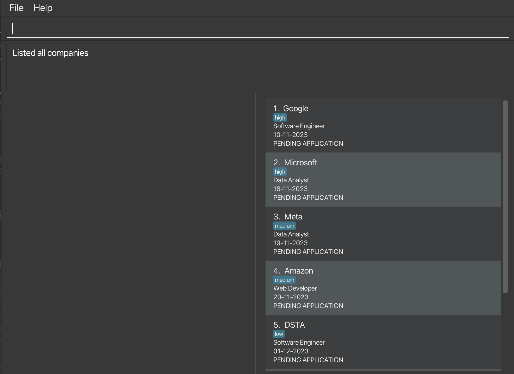

Never miss an internships interview with LinkMeIn! Keep track of all your deadlines in an organised fashion. 

* Table of Contents for the User Guide
{:toc}

--------------------------------------------------------------------------------------------------------------------

## Quick start ##

1. Product only runs on Java 11

2. Refer to the [Features](#features) below for details of each command.

--------------------------------------------------------------------------------------------------------------------

## Current Features ##

### Adding a company : `add` ###

Adds a company to the address book.
The company must have the required fields:
CompanyName, ApplyingRole, ApplicationStatus, Deadline (dd-MM-yyyy), RecruiterName, Email and PhoneNumber.
Order of input **does not** matter.

| Prefix | Application Status     |
|--------|------------------------|
| PA     | PENDING APPLICATION    |
| PI     | PENDING INTERVIEW      |
| PO     | PENDING OUTCOME        |
| A      | ACCEPTED               |
| R      | REJECTED               |

**Format**:</br>
`add c/COMPANY_NAME r/ROLE s/APPLICATION_STATUS d/DEADLINE n/RECRUITER_NAME e/EMAIL p/PHONE_NUMBER [t/tags]`

**Examples**:
* `add c/Tiktok r/Software Engineer s/PA n/John Tan d/10-10-2023 e/johntan@example.com p/987654321`
* `add c/Google n/Mary r/Data Analyst s/R d/11-11-2023 e/johntan@example.com p/987654321 t/high`
* `add c/Meta r/Data Scientist s/PI n/Mary d/12-12-2023 e/mary@example.com p/91234567`

**Acceptable values for each parameter:**<br>
No other string separators other than c/, n/, r/, s/, d/, e/, p/, t/.
Otherwise, the **entire** command will be considered invalid and all data inputted will be discarded.

Example of invalid input: `c/Google n/Mary r/Data Analyst a/R d/11-11-2023 f/`</br> 
Explanation: Invalid f/ string separator.

**Expected output when command succeeds**: </br>
`New company added: {COMPANY_NAME}`

**GUI Changes:** </br>
The company should be added to the existing list of companies on the right.</br>
The company’s information should also be listed on the left panel, which displays all the added fields information. 

**Expected output when command fails:** </br>
`Invalid command format!`</br>
`add: Adds a company to the address book. Parameters: c/COMPANY_NAME r/ROLE s/STATUS d/DEADLINE n/RECRUITER_NAME p/PHONE e/EMAIL [t/TAG]...`</br>
`Example: add c/Google r/Software Engineer s/PA d/10-10-2023 n/Francis Tan p/98765432 e/johnd@example.com t/high`

***To be further updated in V1.3***
* If the COMPANY_NAME field is missing:
`Invalid command format! Missing COMPANY_NAME. Format is add c/COMPANY_NAME
n/RECRUITER_NAME r/ROLE a/APPLICATION_STATUS e/EMAIL p/PHONE_NUMBER`
</br>
</br>
* If the RECRUITER_NAME field is missing:
`Invalid command format! Missing RECRUITER_NAME. Format is add c/COMPANY_NAME n/RECRUITER_NAME
r/ROLE a/APPLICATION_STATUS [e/EMAIL] [p/PHONE_NUMBER]`
</br>
</br>
* If the APPLICATION_STATUS field is missing:
`Invalid command format! Missing RECRUITER_NAME. Format is add
c/COMPANY_NAME n/RECRUITER_NAME r/ROLE a/APPLICATION_STATUS [e/EMAIL] [p/PHONE_NUMBER]`
</br>
</br>
* If the ROLE field is missing:
`Invalid command format! Missing RECRUITER_NAME. Format is add c/COMPANY_NAME
n/RECRUITER_NAME r/ROLE a/APPLICATION_STATUS [e/EMAIL] [p/PHONE_NUMBER]`

**Expected UI:**


### Listing all contacts : `list`

Lists all the contacts in the application at present.

**Format:** `list`

**Examples:** `list`

**Expected UI**:



The list of companies should be listed in the following format below:
```
{COMPANY_NAME 1} {ROLE} {APPLICATION_STATUS} {DEADLINE}

{COMPANY_NAME 2} {ROLE} {APPLICATION_STATUS} {DEADLINE}

{COMPANY_NAME 3} {ROLE} {APPLICATION_STATUS} {DEADLINE}
```
### Deleting a company : `delete` ###

**Format:`delete INDEX`**

You add an entry by mistake or you no longer want to track a particular company, 
you can delete it using the delete command. Which deletes the company at the specified INDEX.

* The index refers to the index number shown in the displayed company list
* The index must be a positive integer
* The index must not be out of bounds.
* You can only delete one company at a time.

**Examples:**
* `list` followed by `delete 1` deletes the first contact in the full list
* `find` TikTok followed by `delete 1` deletes the first contact in the results of find TikTok

**What you will see when command succeeds:**

Company at specified index removed and list of companies updated

| Before | After                              |
|--------|------------------------------------|
|  |  |

> 
> Note: If you are viewing the details of the company that you are deleting, the details panel will be cleared too.


### View full company information: `view` ###

**Format:** `view INDEX`

You look at the list of companies and you see a company that has not been getting back to you. You can use the view 
command to view the company's recruiter's contact details to follow up with them. The view command allows you to view
the company detail of the company at the specified INDEX.

* The index refers to the index number shown in the displayed company list
* The index must be a positive integer
* The index must not be out of bounds.
* You can only view one company at a time.

**Example:**
* `view 1` displays application details of the first company in the full list

**What you will see when command succeeds:**

| Before                            | After                            |
|-----------------------------------|----------------------------------|
|  |  |


The company’s information should be listed on the left panel and you will see the following fields:
1. COMPANY_NAME 
2. APPLICATION_STATUS
3. ROLE
4. DEADLINE
5. RECRUITER_NAME
6. EMAIL 
7. PHONE
8. PRIORITY

### Find a company: `find` ###

**Format:** `find KEYWORD [MORE_KEYWORDS]...`

You wish to find a specific company in the list of companies. You can use the find command to find the 
company that you are looking for. The find command allows you to find the company whose name contain any of the 
given keywords.

- The search is case-insensitive. e.g `tiktok` will match `TikTok`
- The order of the keywords does not matter. e.g. `tiktok google` will match `Google TikTok`
- Only the company name is searched.
- Only full words will be matched e.g. `tik` will not match `tiktok`
- Only companies with names that contain all the keywords will be returned e.g. `tiktok google` will match `Google TikTok` but not `TikTok`

**Examples:**
* `find TikTok` returns `TikTok`
* `find TikTok Google` returns `TikTok Google`

**What you will see when command succeeds:**


### Edit a company's information: `edit` ###
Edits the information of a particular company.

**Format:** `edit INDEX [c/COMPANY_NAME] [n/RECRUITER_NAME] [r/ROLE] [s/APPLICATION_STATUS] [d/DEADLINE] [e/EMAIL] [p/PHONE_NUMBER] [t/TAG]…`

* Edits the company at the specified INDEX. The index refers to the index number shown in the displayed company list. The index must be a positive integer 1, 2, 3, ...
* At least one of the optional fields must be provided.
* Existing values will be updated to the input values.
* When editing tags, the existing tags of the company will be removed i.e adding of tags is not cumulative.
* You can remove all the company’s tags by typing t/ without specifying any tags after it.

**Examples:**
* `edit 2 s/Pending Application r/frontend developer` edits the status and role of the 2nd person to be Pending Application and frontend developer respectively.
* `edit 3 e/example@abc.com t/` edits the email of the 3rd person to be example@abc.com and clears all existing tags.

**Acceptable values for each parameter:**
* INDEX must be a number. If not the entire command will be considered invalid input.
* INDEX must not be out of bounds. If not the entire command will be considered invalid input.
* INDEX must be more than zero. If not the entire command will be considered invalid input.
* No other string separators other than c/, n/, r/, s/, d/, e/, p/. Otherwise, the entire command will be considered invalid and all data inputted will be discarded.

**Expected output when command succeeds:**</br>
`{COMPANY_NAME} company edited.`

**Expected output when command fails:** </br>
* If INDEX is out of bounds: </br>
  `The company index provided is invalid`
* If invalid string separator: </br>
  `Invalid command format! edit: Edits the details of the company identified by the index number used in the displayed company list. Existing values will be overwritten by the input values.
  Parameters: INDEX (must be a positive integer) [c/COMPANY_NAME] [n/RECRUITER_NAME] [r/ROLE] [s/APPLICATION_STATUS] [d/DEADLINE] [e/EMAIL] [p/PHONE] [t/TAG]...
  Example: edit 1 p/91234567 e/johndoe@example.com`
* If empty input after string separator: </br>
  `Please enter a valid {field}`

**Expected UI** <br/>


## Upcoming Features ##

TBD

--------------------------------------------------------------------------------------------------------------------

## FAQ ##

TBD.

--------------------------------------------------------------------------------------------------------------------

## Known issues ##

TBD.
--------------------------------------------------------------------------------------------------------------------

## Command summary ##

| Action     | Format, Examples                                                                                                                                                                                                              |
|------------|-------------------------------------------------------------------------------------------------------------------------------------------------------------------------------------------------------------------------------|
| **Add**    | `add c/COMPANY_NAME r/ROLE d/DEADLINE s/APPLICATION_STATUS n/RECRUITER_NAME e/EMAIL p/PHONE_NUMBER [t/tags]` <br><br> e.g., `add c/Tiktok r/Software Engineer s/PA d/11-11-2023 n/John Tan e/johntan@example.com p/987654321` |
| **Delete** | `delete INDEX`<br><br> e.g., `delete 3`                                                                                                                                                                                       |
| **View**   | `view INDEX`<br><br> e.g., `view 3`                                                                                                                                                                                           |                                                                                                                                                                                     |
| **Edit**   | `edit INDEX [c/COMPANY_NAME] [n/RECRUITER_NAME] [r/ROLE] [a/APPLICATION_STATUS] [d/DEADLINE] [e/EMAIL] [p/PHONE_NUMBER] [t/TAG]…` <br/><br/> e.g., `edit 2 s/Pending Application r/frontend developer`                        |
