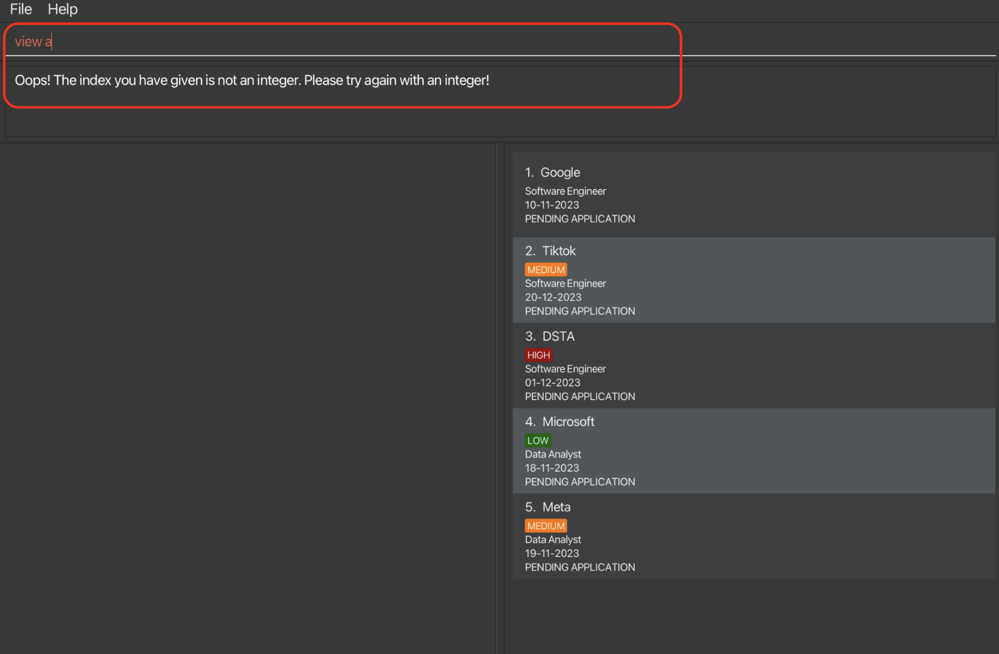
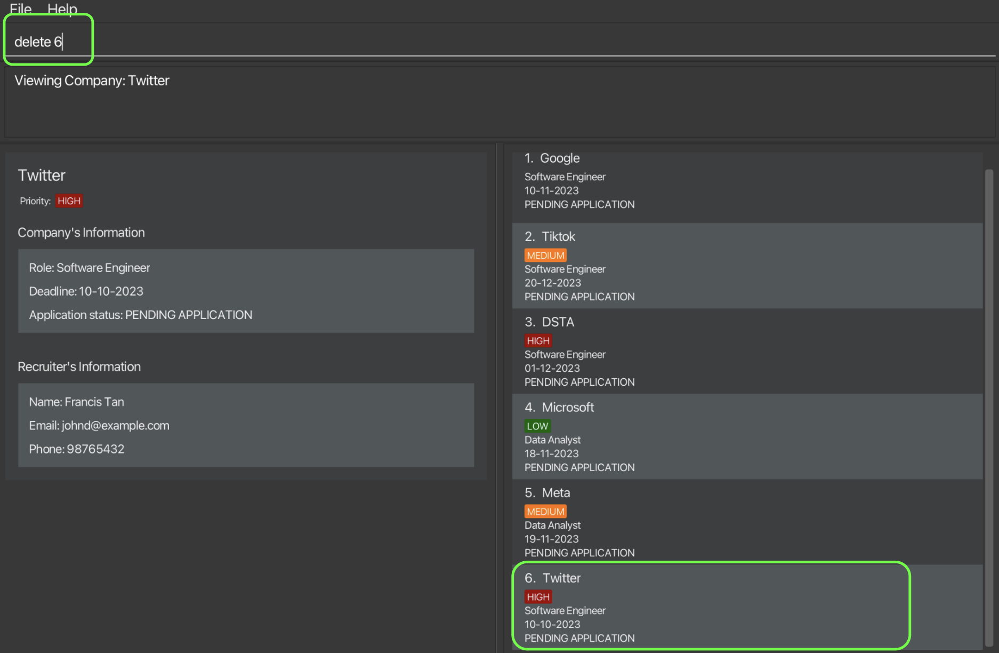
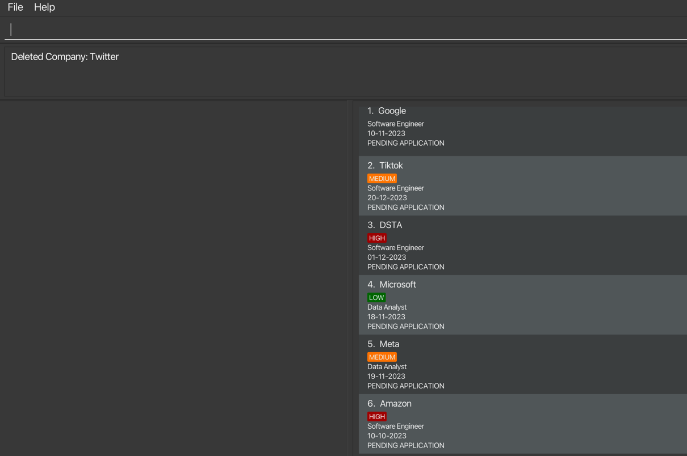
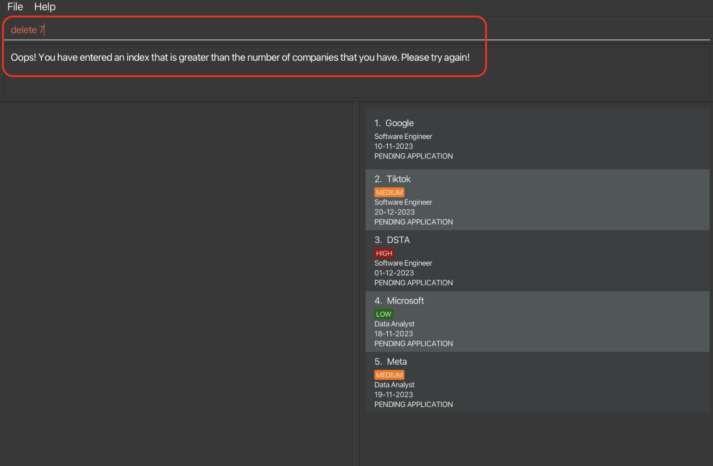

# Welcome to LinkMeIn!

_Master Your Internship Journey: Every Deadline, Every Detail._

LinkMeIn is a **desktop application** built for [NUS School Of Computing (SOC) students](https://www.comp.nus.edu.sg/) to
track their internship applications. It is recommended that you read this manual before using the application.

Here is a **quick** overview of your internship journey with LinkMeIn:
<br>
* **Effortless** Tracking: Seamlessly store internship listings, adjust details with changing circumstances, and swiftly recall past applications by date.
  <br>
  </br>
* Stay Empowered and **Informed**: Dive into specific application details when needed and access guidance with a click, ensuring you're always confident in your next step.
  <br>
  </br>
* Share and **Simplify**: After landing that internship, de-clutter your list and easily locate company details to guide your peers in their own searches.
  </br>


Additionally, LinkMeIn combines the rapid **efficiency** of CLI with the visual clarity of GUI,
offering a **tailored** experience for internship management that outpaces the generic
spreadsheets of Excel.

# Navigating the user guide

## Typographic conventions

<div class="typography-box warning">
  <span class="icon">❗</span>
  <span class="content">
    <strong>Warning :</strong> Alerts users to potential pitfalls or things to be cautious of when using your application.
  </span>
</div>

<div class="typography-box tip">
  <span class="icon">💡</span>
  <span class="content">
    <strong>Tip :</strong> Provides users with additional insights or more efficient ways to use your application.
  </span>
</div>

<div class="typography-box note">
  <span class="icon">ℹ️</span>
  <span class="content">
    <strong>Note :</strong> Highlights supplementary information that users should be aware of, but isn't necessarily mission-critical.
  </span>
</div>

<div class="typography-box code">
  <span class="icon">🖋</span>
  <span class="content">
    <strong>Code :</strong> Indicates commands or programming-related content that can be typed or referred to.
  </span>
</div>

## Non-typographic conventions
For the feature section, each page follows a predictable syntax and style.
<br>
</br>
Proceed to explain ... [TODO]

# Table of Contents

* TOC 
{:toc}

# Quick start

1. Make sure that you have **Java 11 or above** installed in your Computer.
  - [How to check if you have Java installed?](#faq-1)
  - [How to check if you have Java 11 or above?](#faq-2)

2. Download the latest jar file from [here]()

3. Copy the file to the folder you want to use as the home folder for your LinkMeIn.

  - Create a new folder (you can name it LinkMeIn) where you would like to house the application
    (e.g., Desktop, Documents, etc.)
  - Move the downloaded jar file as shown:

    - For Windows users
    - For Mac users

4. Launch LinkMeIn

  - For Windows users

    - Double-click on the `LinkMeIn.jar` file to launch the application

  - For Mac users

    - Open up your terminal (Command +Space > type Terminal > Enter)
    - Navigate to the folder where you have placed the jar file with the `cd` command
    - For example if you have placed the jar file in the Documents folder, type `cd Documents` and press Enter

<div class="typography-box warning">
  <span class="icon">❗️</span>
  <span class="content">
    <strong>Warning :</strong> Do not move or delete the `data` folder as it contains the data of your applications.
  </span>
</div>

You should notice the GUI of the application pop up.
1. Learn more about navigating the GUI [here]().
2. For new users, learn to use LinkMeIn [here]().
3. For advanced users, view all feature details [here]().

--------------------------------------------------------------------------------------------------------------------

# Current Features #

## General Features ##
### Clear all entries: `clear` ###
Clears all entries of internship application.

**Format:** `clear`

:warning: Entries cannot be recovered after clearing.

### Exit LinkMeIn: `exit` ###
Exits the program and closes the window.

**Format:** `exit`

### Help: `help` ###
Exits the program and closes the window.

**Format:** `exit`

## Company Management Features ##

### Adding a company : `add` ###

_You scroll through your LinkedIn feed and see a company that you are interested in.
You wish to start on the application later, but you are afraid that you will forget about it.
Add the company to LinkMeIn now to keep track of the application process using the `add` command!_

**Format**:
`add c/COMPANY_NAME r/ROLE s/APPLICATION_STATUS d/DEADLINE n/RECRUITER_NAME e/EMAIL p/PHONE_NUMBER [pr/PRIORITY]`

> All [**parameters**](#parameters-description-) specified in the format are compulsory except for PRIORITY.


<div class="typography-box note">
  <span class="icon">ℹ️</span>
  <span class="content">
    <strong>Note :</strong> Order of input **does not** matter. 
  </span>
</div>


**Example:**</br>
1. You came across the _Software Engineer_ role from _Apple_ which you are interested to apply for after touching up your resume. The deadline for this application is _10 October 2023_. The recruiter's name is _John Tan_, and you noted down his email address _johnd@example.com_ and his phone number _98765432_, so that you can contact him in the future. The priority of this application is _medium_ as you have other applications that you want to focus on first.

2. With the information above, you can add the company's application into LinkMeIn using the `add` command. Simply type `add c/Apple r/Software Engineer s/PA n/John Tan d/12-12-2023 e/johntan@example.com p/987654321 pr/medium` into the command box and press Enter.

     

3. The detail panel will be updated to show the details of the newly added company's application, and the company will be added to the list of companies. 


2. You can proceed to add more companies by repeating the steps above!

**Possible Error:**</br>
If you enter an invalid input for any of the prefixes, you will see an error message in the command box. Check the [**parameter constraints**](#parameters-description-) for the respective prefix and try the command again! An example of an error message is shown below. 


[&uarr; Back to Table of Contents](#table-of-contents)

### View full company information: `view` ###

_You look at the list of companies and you see a company that has not been getting back to you. You can use the view
command to view the company's recruiter's contact details to follow up with them. The view command allows you to view
the detail of any company from the list of companies that you have added._

**Format:** `view INDEX`
> INDEX must be a positive integer number e.g 1,2,3... and must not be greater than the number of company in the list.

<div class="typography-box note">
  <span class="icon">ℹ️</span>
  <span class="content">
    <strong>Note :</strong> INDEX refers to the index number shown in the displayed company list.
  </span>
</div>

**Example:**
1. After scrolling through your list of companies, you wish to view the details of the company _Twitter_. 
Simply type `view 6` to view _Twitter's_ details.


2. The detail panel will be updated to show the details of _Twitter_.


**Possible Error:**</br>
If you enter an [**invalid index**](#7-what-is-an-invalid-index-), you will see an error message in the command box. 
Don’t worry, just edit your index accordingly and try the command again!
An example of an error message is shown below.



[&uarr; Back to Table of Contents](#table-of-contents)

### Deleting a company : `delete` ###

_Whether you accidentally added a company or no longer want to track it, don't worry! LinkMeIn got you covered!
You can use the delete command to delete the company from the list of companies that you have added._

**Format:`delete INDEX`**

> INDEX must be a positive integer number e.g 1,2,3... and must not be greater than the number of company in the list.

<div class="typography-box note">
  <span class="icon">ℹ️</span>
  <span class="content">
    <strong>Note :</strong> INDEX refers to the index number shown in the displayed company list. 
You can only delete one company at a time. 
  </span>
</div>

**Example:**
1. Let's say after viewing the company _Twitter_, you decide that you no longer want to track it. 
Simply type `delete 6` to delete _Twitter_.


2. Twitter will be removed from the list of companies. The detail panel will be cleared too.


**Possible Error:**

If you enter an [**invalid index**](#7-what-is-an-invalid-index-), 
you will see an error message in the command box. Don’t worry, just edit your index accordingly and 
try the command again!
An example of an error message is shown below.



[&uarr; Back to Table of Contents](#table-of-contents)

### Edit a company's information: `edit` ###
If you made a typo or need to update the progress of application,
use the `edit` command to input the accurate details.

**Format:** `edit INDEX [c/COMPANY_NAME] [n/RECRUITER_NAME] [r/ROLE] [s/APPLICATION_STATUS] [d/DEADLINE] [e/EMAIL] [p/PHONE_NUMBER] [pr/PRIORITY] [nt/NOTE]`

* `INDEX`: Edits the company at INDEX number shown in the displayed company list.
* `[c/COMPANY_NAME]` etc. : type prefix `c/` followed by new company name to edit company name.
* At least one of the optional fields must be provided.

:warning: When editing the note, the existing note of the company will be removed i.e. adding of note is not cumulative.

**Examples:** </br>
1.Type `edit 2 s/PI r/Frontend Developer`


2.The 2nd company's the status and role is edited to be Pending Interview and Frontend Developer respectively.


[&uarr; Back to Table of Contents](#table-of-contents)

## Company List Features ##
### Find a company: `find` ###

**Format:** `find KEYWORD [MORE_KEYWORDS]...`

You wish to find a specific company in the list of companies. You can use the find command to find the
company that you are looking for. The find command allows you to find the company whose name contain any of the
given keywords.

- The search is case-insensitive. e.g `tiktok` will match `TikTok`.
- The order of the keywords does not matter. e.g. `tiktok google` will match `Google TikTok`.
- Only the company name is searched.
- Only full words will be matched e.g. `tik` will not match `tiktok`.
- Only companies with names that contain all the keywords will be returned e.g. `tiktok google` will match `Google TikTok` but not `TikTok`.

**Examples:**
* `find TikTok` returns `TikTok`
* `find TikTok Google` returns `TikTok Google`

**What you will see when command succeeds:**


[&uarr; Back to Table of Contents](#table-of-contents)

### Listing all contacts : `list`

_You've found the specific company you wanted using the find command earlier, and now you want to see all of your applications in one list again. You can do so easily with the `list` command!_

**Format:** `list`

**Example:**
1. You have used the `find` command to find the company _TikTok_ earlier. Now, you want to see all of your applications in one list again. Simply type `list` to view the full list of your applications again!


<div class="typography-box note">
  <span class="icon">ℹ️</span>
  <span class="content">
    <strong>Note:</strong> Whenever LinkMeIn is started, you will see the full list of companies displayed by default (i.e. `list` command is executed automatically).
  </span>
</div>

[&uarr; Back to Table of Contents](#table-of-contents)

### Filter companies by application status: `filter` ###
Can't remember which applications you haven't submitted or want to prepare for the companies that have offered you an interview?
Filter the list of companies by their application status using the `filter` command!

**Format:** `filter s/APPLICATION_STATUS`
> [**APPLICATION_STATUS**](#application-status-description-) should be one of the following: `PA`, `PI`, `PO`, `A`, `R`. 

**Example:**
1. You want to prepare for the upcoming interviews you received. 
2. Simply type `filter s/PI` to filter the list of companies to show only companies with status "Pending Interview".
   
3. You can then view the details of the companies that you have interviews for from the company list.
   

**Possible Error:**</br>

If you enter an invalid application status, you will see an error message in the command box. Don’t worry, try the command again with a [**valid application statuses**](#application-status-description-).
An example of an error message is shown below.

[&uarr; Back to Table of Contents](#table-of-contents)

--------------------------------------------------------------------------------------------------------------------

## Glossary ##

### Definitions of Key Terms ###
Encountered an unfamiliar term when using LinkMeIn? Read the respective descriptions to better understand the term!

| Term          | Definition                                                                                                                                                                                                                          |
|---------------|-------------------------------------------------------------------------------------------------------------------------------------------------------------------------------------------------------------------------------------|
| **CLI**       | Command-Line Interface (CLI) is a text-based user interface where users interact with the application by typing commands.                                                                                                           |
| **GUI**       | Graphical User Interface (GUI) is a visual method to interact with software using icons, buttons, and windows. GUI provides a user-friendly way to interact with software using graphical elements rather than text-based commands. |
| **Command**   | A command is an instruction given by a user to LinkMeIn to perform a specific action. For example,`add` command is a command to add the company's application into LinkMeIn.                                                        |
| **Parameter** | Parameter is similar to a field in a form you have to fill up. For example, in the command `edit 1 c/COMPANY_NAME e/EMAIL`, `c/COMPANY_NAME` and `e/EMAIL` are parameters in the command.                                           |
| **Prefix**    | Prefix is a keyword that is used to identify the parameter. For example, in the command `edit 1 c/COMPANY_NAME e/EMAIL`, `c/` and `e/` are prefixes.                                                                                |
### Parameters Description ###
| Parameter            | Description                                   | Constraints                                                                           |
|----------------------|-----------------------------------------------|---------------------------------------------------------------------------------------|
| c/Company Name       | Name of the company that you are applying to. | Only contain alphanumeric characters and spaces, and should not be blank.             |
| r/Role               | Role of the internship that you are applying. | Only contain alphanumeric characters and spaces, and should not be blank.             |
| s/Application Status | Status of the application.                    | Case-insensitive and should be one of the following: `PA`, `PI`, `PO`, `A`, `R`.      |
| d/Deadline           | Deadline of the application.                  | Should be in DD-MM-YYYY format.                                                       |
| n/Recruiter Name     | Name of the recruiter.                        | Only contain alphanumeric characters and spaces, and should not be blank.             |
| e/Email              | Email of the recruiter.                       | Should be in the format of `local-part@domain` and should not be blank.               |
| p/Phone Number       | Phone number of the recruiter.                | Only contain numbers, and should be at least 3 digits long. Should not be blank.      |
| pr/Priority          | Priority of the application.                  | Case-insensitive and should be one of the following: `high`, `medium`, `low`, `none`. |

### Application Status Description ###
| Application Status | Description                                                                                                                                                          |
|--------------------|----------------------------------------------------------------------------------------------------------------------------------------------------------------------|
| PA                 | Pending Application. This means that you have not submitted the application, but are currently working on it.                                                        |
| PI                 | Pending Interview. This means that you have submitted the application, and are either waiting for an interview offer, or waiting to go for the interview.            |
| PO                 | Pending Outcome. This means that you have went through the interview, but the final decision or outcome (whether accepted or rejected) hasn't been communicated yet. |
| A                  | Accepted. This means you have been offered the internship position. Congratulations!                                                                                 |
| R                  | Rejected. Unfortunately, this means that the application wasn't successful and you were not offered the internship. Don't worry, try again next time!                |


--------------------------------------------------------------------------------------------------------------------
## FAQ ##
### 1. How do I check if I have Java installed? ###

* Open up your terminal and type `java -version`. If you have Java installed, you should see something like this:
```
java version "
OpenJDK Runtime Environment (build
OpenJDK 64-Bit Server VM (build
```

* If you do not have Java installed, you can download it [here](https://www.oracle.com/sg/java/technologies/javase-downloads.html).
* If you are using Windows, you can refer to this [guide](https://www.java.com/en/download/help/windows_manual_download.html) to install Java.
* If you are using Mac, you can refer to this [guide](https://www.java.com/en/download/help/mac_install.html) to install Java.
* If you are using Linux, you can refer to this [guide](https://www.java.com/en/download/help/linux_x64_install.html) to install Java.
* If you are using Ubuntu, you can refer to this [guide](https://www.digitalocean.com/community/tutorials/how-to-install-java-with-apt-on-ubuntu-20-04) to install Java.

### 2. How do I check if I have Java 11 or above? ###
Open up your terminal and type `java -version`. If you have Java 11 or above installed, you should see something like this:
``` 
openjdk version "
OpenJDK Runtime Environment (build
OpenJDK 64-Bit Server VM (build
```
### 3. How do I load data from another computer? ###
Delete the `addressbook.json` file (stored at `[JAR file location]/data/addressbook.json`) from the computer that you wish to use LinkMeIn on. Then, copy over the `addressbook.json` file from the computer which you no longer wish to use LinkMeIn on. After which, boot up LinkMeIn to check whether your doctor information is properly loaded into the new computer.

### 4. Why am I unable to run LinkMeIn?  ###
Make sure you have Java 11 installed on your machine as the product only runs on Java 11.

### 5. How can I add priority to my internship application details? ### 
When adding a new company, use the `pr/` prefix followed by the priority value. For instance, `pr/high` to set the priority to high.

### 6. How do I load data from another computer? ### 
Delete the `addressbook.json` file (stored at `[JAR file location]/data/addressbook.json`) from the computer that you wish to use LinkMeIn on. Then, copy over the `addressbook.json` file from the computer which you no longer wish to use LinkMeIn on. After which, boot up LinkMeIn to check whether your doctor information is properly loaded into the new computer.

### 7. What is an invalid index? ###
An invalid index is a non-positive integer or an index greater than the number of companies you have. 
e.g -1, 0, a, *, 1  0 (Only one index is allowed at a time). 

--------------------------------------------------------------------------------------------------------------------

## Known issues ##

--------------------------------------------------------------------------------------------------------------------

## Command Summary ##

| Command     | Format                                                                           | Example                                                                                                          |
|-------------|----------------------------------------------------------------------------------|------------------------------------------------------------------------------------------------------------------|
| `add`       | `add c/COMPANY_NAME r/ROLE s/APPLICATION_STATUS d/DEADLINE n/RECRUITER_NAME e/EMAIL p/PHONE_NUMBER [pr/priority]` | `add c/Tiktok r/Software Engineer s/PA n/John Tan d/10-10-2023 e/johntan@example.com p/987654321`              |
| `list`      | `list`                                                                           | `list`                                                                                                           |
| `find`      | `find KEYWORD [MORE_KEYWORDS]...`                                                 | `find TikTok`                                                                                                   |
| `view`      | `view INDEX`                                                                     | `view 1`                                                                                                        |
| `delete`    | `delete INDEX`                                                                   | `delete 1`                                                                                                      |
| `edit`      | `edit INDEX [c/COMPANY_NAME] [n/RECRUITER_NAME] [r/ROLE] [s/APPLICATION_STATUS] [d/DEADLINE] [e/EMAIL] [p/PHONE_NUMBER] [pr/PRIORITY] [nt/NOTE]` | `edit 2 s/PI r/Frontend Developer`                                                |

